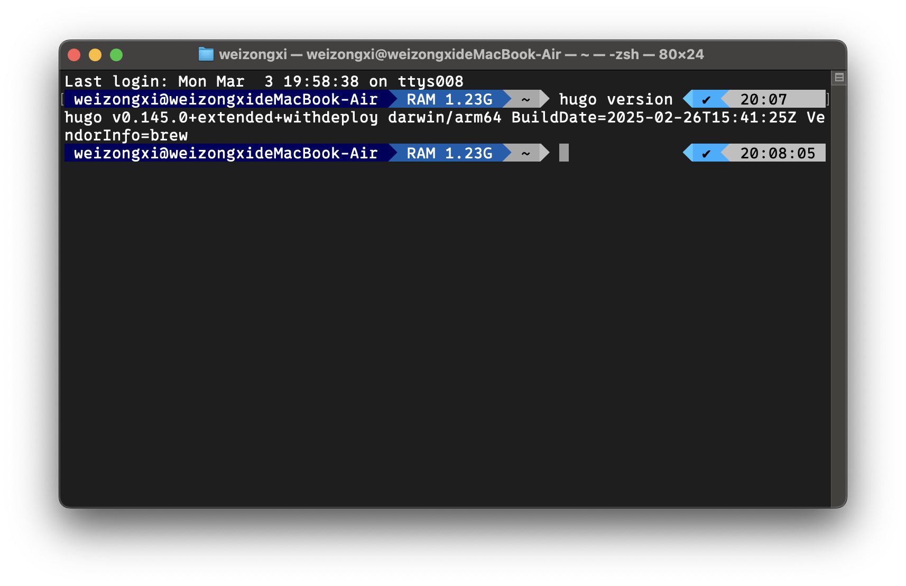
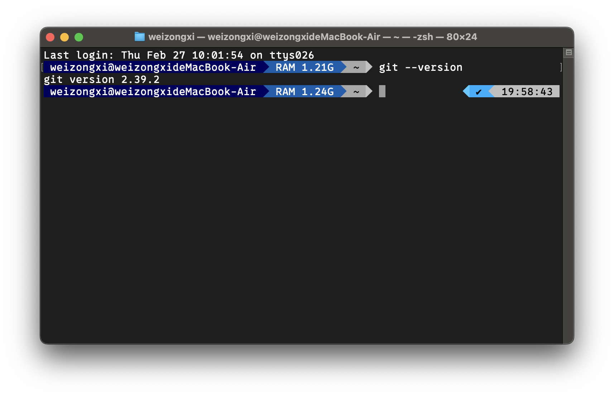
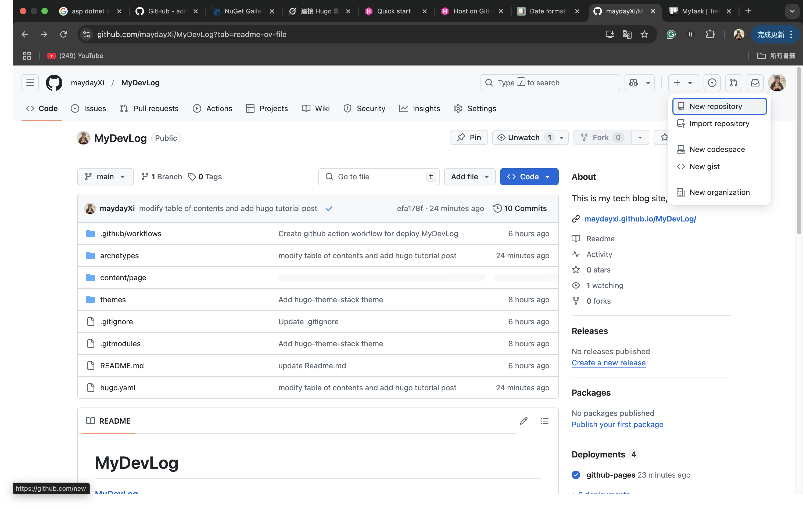
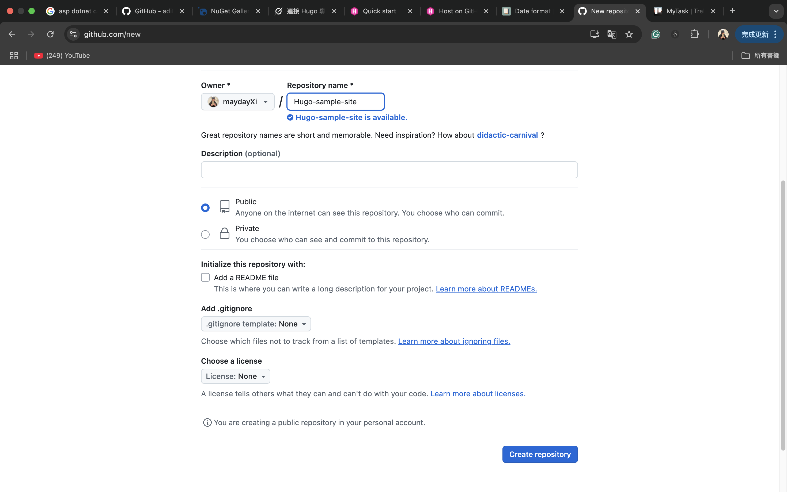
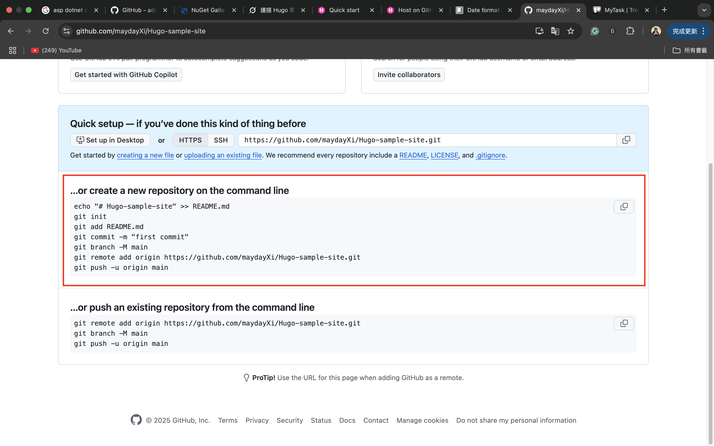
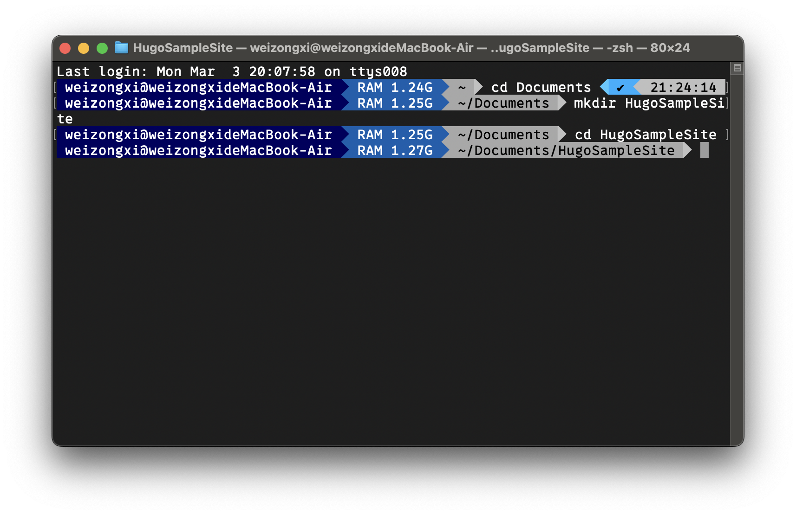
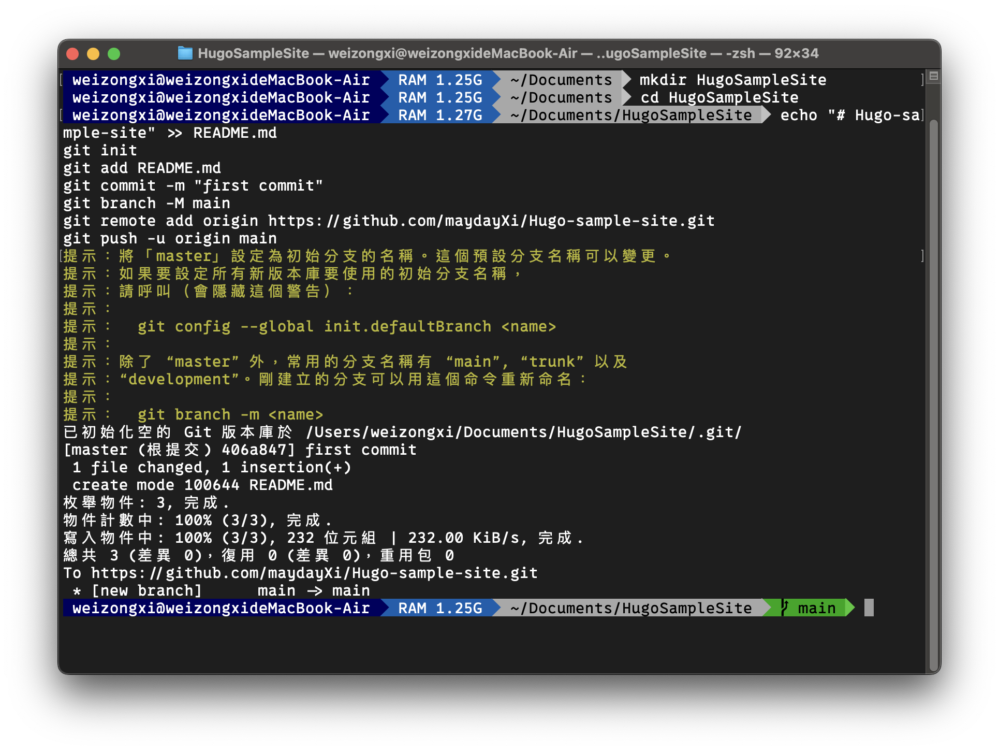
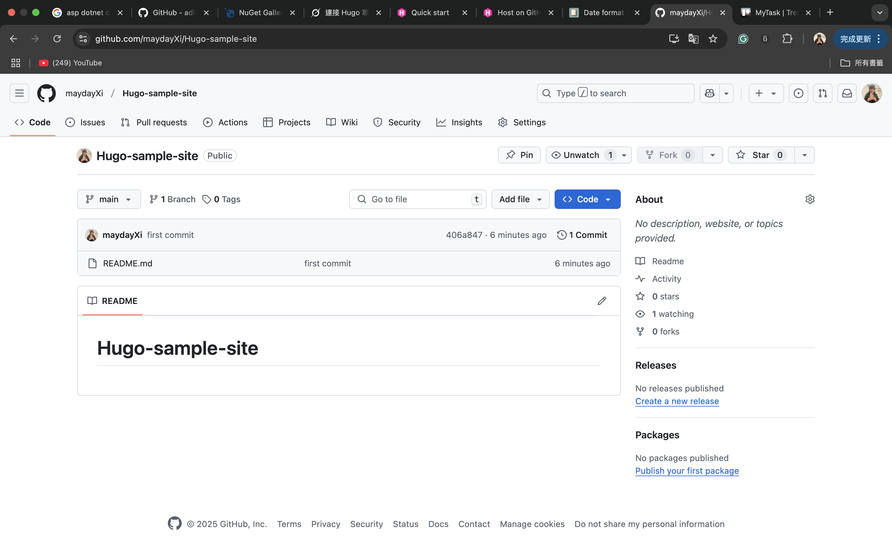

# 為什麼寫這篇教學

最近在面試的時候，被面試官問到「**有沒有什麼可以代表你**」的東西，我才發現我累積了一些經驗，也做了一些做品，但缺少了整合，所以讓我開始思考要架設一個自己的 Blog。在搜尋方法的同時我發現了 Hugo 這樣的一個強大工具，也讓我產生了要使用 Hugo 架設的想法。

我的 Blog 是使用 Hugo 架設的，所以有個實際的案例，用來做為 Blog 的首篇文章非常適合。其次在架設的過程中遇到了一些設定上的問題，希望可以紀錄下來，整理成一個指南，並分享給所有要用 Hugo 架站的人。

# Hugo 簡介

[Hugo](https://gohugo.io/) 從官方網站的介紹可以知道，它是一個可以快速產生靜態網頁的工具。再加上有豐富的網站[主題](https://themes.gohugo.io/)可以套用，所以非常適合用來建立個人網站。

# 安裝套件

由於我是使用 mac 電腦，所以以下教學會以 **`macOS`** 為主

所有步驟可以參考 _[Hugo Quick Start](https://gohugo.io/getting-started/quick-start/)_

## 安裝 Homebrew

homebrew 是一個開源的套件管理工具，專門為 macOS 及 Linux 系統設計的。

開啟終端機輸入

```bash
/bin/bash -c "$(curl -fsSL https://raw.githubusercontent.com/Homebrew/install/HEAD/install.sh)"
```

## 安裝 Hugo

安裝完 Homebrew 後，在終端機中輸入

```bash
brew install hugo
```

安裝完成後，可以確認 hugo 的版本

```bash
hugo version
```



## 安裝 Git

Git 是一個程式碼版本控制的工具，後面佈署的時候會用 _[Git Pages](https://pages.github.com/)_ 的服務

一樣使用終端機安裝，在終端機輸入，可以參考 _[Git Download for macOS](https://git-scm.com/downloads/mac)_ 或 _[Installing Git](https://git-scm.com/book/en/v2/Getting-Started-Installing-Git)_

```bash
brew install git
```

安裝完 git 後，可以確認 git 的版本

```bash
$ git --version
```



# 建立 Repository

接下來的部分涉及到 git 的知識，本篇只介紹基本關念，其餘有興趣可以自行 Google。

Repository 可以想像是程式碼儲存目錄，又分成下面兩種

- GitHub Repository：雲端的儲存目錄
- Local Repository：本機電腦的儲存目錄

## 新增 GitHub Repository

佈署的時候會使用 GitHug Pages，所以需要有一個 GitHub 的帳號

到 Github 自己帳號的首頁，找到「**+ ▼**」，選「**New repository**」



接著在「**Repository name**」輸入名稱，然後按下「**Create repository**」



## 新增本機 Repository

在建立完 GitHub 的 Repository 後，會看如下的畫面，由於是新建立網站專案，所以要選上面那一個，複製它



開啟終端機，先建立本機目錄，這邊以 `Documents/HugoSampleSite` 為例，也可以建立在其他自己想要的位置

指令說明

- cd：Change directory，切換到指定目錄
- mkdir：Make directory，新增目錄（文件夾）

```bash
cd Documents
mkdir HugoSampleSite
cd HugoSampleSite
```



## 同步 Repository

接下來要同步遠端及本機的 Repository，在終端機把 GitHub Repository 複製的代碼貼上

```bash
echo "# Hugo-sample-site" >> README.md
git init
git add README.md
git commit -m "first commit"
git branch -M main
git remote add origin https://github.com/maydayXi/Hugo-sample-site.git
git push -u origin main
```



完成後到 GitHub 網站上重新整理，如果出現下面的畫面就表示同步成功了


