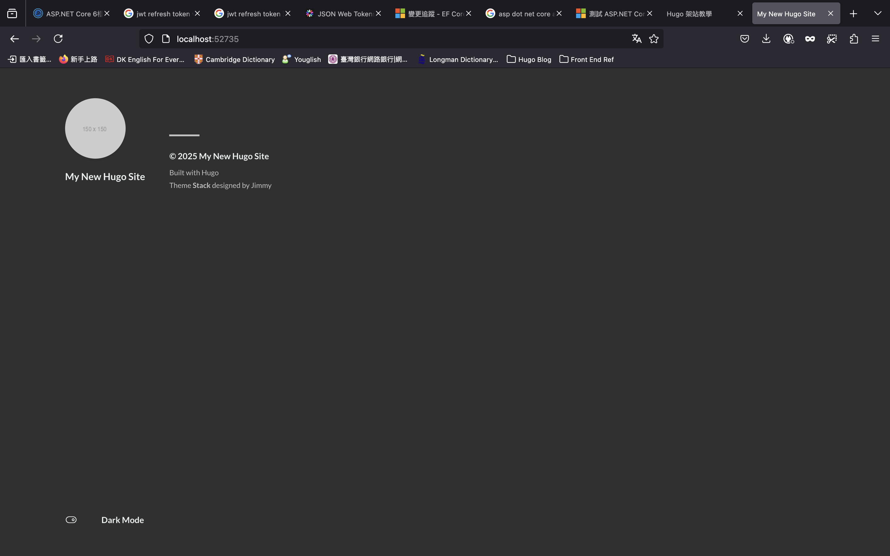

# 為什麼寫這篇教學

最近在面試的時候，被面試官問到「**有沒有什麼可以代表你**」的東西，我才發現我累積了一些經驗，也做了一些做品，但缺少了整合，所以讓我開始思考要架設一個自己的 Blog。在搜尋方法的同時我發現了 Hugo 這樣的一個強大工具，也讓我產生了要使用 Hugo 架設的想法。

我的 Blog 是使用 Hugo 架設的，所以有個實際的案例，用來做為 Blog 的首篇文章非常適合。其次在架設的過程中遇到了一些設定上的問題，希望可以紀錄下來，整理成一個指南，並分享給所有要用 Hugo 架站的人。

# 重點

1. 建立 GitHub Repository
2. 建立 Hugo 網站
3. 套用 Hugo 主題

# Hugo 簡介

**_[Hugo](https://gohugo.io/)_** 從官方網站的介紹可以知道，它是一個可以快速產生靜態網頁的工具。再加上有豐富的網站**_[主題](https://themes.gohugo.io/)_**可以套用，所以非常適合用來建立個人網站。

# 安裝套件

由於我是使用 mac 電腦，所以以下教學會以 **`macOS`** 為主

所有步驟可以參考 **_[Hugo Quick Start](https://gohugo.io/getting-started/quick-start/)_**

## 安裝 Homebrew

homebrew 是一個開源的套件管理工具，專門為 macOS 及 Linux 系統設計的。

開啟終端機輸入

```bash
/bin/bash -c "$(curl -fsSL https://raw.githubusercontent.com/Homebrew/install/HEAD/install.sh)"
```

## 安裝 Hugo

安裝完 Homebrew 後，在終端機中輸入

```bash
brew install hugo
```

安裝完成後，可以確認 hugo 的版本

```bash
hugo version
```


## 安裝 Git

Git 是一個程式碼版本控制的工具，後面佈署的時候會用 **_[Git Pages](https://pages.github.com/)_** 的服務

一樣使用終端機安裝，在終端機輸入，可以參考 **_[Git Download for macOS](https://git-scm.com/downloads/mac)_** 或 **_[Installing Git](https://git-scm.com/book/en/v2/Getting-Started-Installing-Git)_**

```bash
brew install git
```

安裝完 git 後，可以確認 git 的版本

```bash
$ git --version
```


# 建立 Repository

接下來的部分涉及到 git 的知識，本篇只介紹基本關念，其餘有興趣可以自行 Google。

Repository 可以想像是程式碼儲存目錄，又分成下面兩種

- GitHub Repository：雲端的儲存目錄
- Local Repository：本機電腦的儲存目錄

## 新增 GitHub Repository

佈署的時候會使用 GitHug Pages，所以需要有一個 GitHub 的帳號

到 Github 自己帳號的首頁，找到「**+ ▼**」，選「**New repository**」


接著在「**Repository name**」輸入名稱，然後按下「**Create repository**」


## 新增本機 Repository

在建立完 GitHub 的 Repository 後，會看如下的畫面，由於是新建立網站專案，所以要選上面那一個，複製它


開啟終端機，先建立本機目錄，這邊以 `Documents/HugoSampleSite` 為例，也可以建立在其他自己想要的位置

指令說明

- cd：Change directory，切換到指定目錄
- mkdir：Make directory，新增目錄（文件夾）

```bash
cd Documents
mkdir HugoSampleSite
cd HugoSampleSite
```


## 同步 Repository

接下來要同步遠端及本機的 Repository，在終端機把 GitHub Repository 複製的代碼貼上

```bash
echo "# Hugo-sample-site" >> README.md
git init
git add README.md
git commit -m "first commit"
git branch -M main
git remote add origin https://github.com/maydayXi/Hugo-sample-site.git
git push -u origin main
```


完成後到 GitHub 網站上重新整理，如果出現下面的畫面就表示同步成功了


# 建立 Hugo 網站

參考 **_[Hugo create a site](https://gohugo.io/getting-started/quick-start/#create-a-site)_**

先確定目前的工作目錄是在**本機 Repository 的上一層**，下面會說明為什麼

- pwd：print work directory 印出目前的工作（所在）目錄

```bash
pwd
```

## 切換工作目錄（optional）

如果已經在上一層目錄，可以跳過，直接下一步強制建立

以我的例子來說需要在 `Documents`，如果你照著教學做下來應該不會在 Documents 目錄

- ..：上一層目錄

```bash
cd ..
```


## 建立網站-強制

在終端機輸入指令 `hugo new site <directory name>`

`<directory name>` 是網站要產生的**目的目錄**，所以上一個步驟才需要回到 repository 的上一層

參考 **_[Hugo Create Site](https://gohugo.io/getting-started/quick-start/#create-a-site)_**

~~當然也可以在 repository 目錄下建立，不過這目錄結構會變成下面這樣，有點多餘（不建議）~~

```tree
-┬HugoSampleSite
 |--HugoSampleSite
```

由於 `HugoSampleSite` 目錄中已經有其他檔案存在（git 的相關設定檔），所以要強制建立
網站，在指令的最後加上 **--force**

```bash
hugo new site HugoSampleSite --force
```

原因在於 **hugo new site path** 只能建立在空的目錄，參考 **_[hugo new site](https://gohugo.io/commands/hugo_new_site/#hugo-new-site)_** 說明，如果沒有加 **--force** 會出現錯誤訊息


在強制建立完成後，如果有看到 **Just a few more step** 的相關訊息，就是建立完成，也可以開啟網站所在目錄，確認網站建立完成


# 第一版程式上傳

可以的話請先閱讀 **_[版本控制特別說明](#上傳第二版程式)_**，再決定是否要上傳第一版。
也可以在第二版上傳步驟一次上傳。

終端機輸入 **cd HugoSampleSite** 切回 `HugoSampleSite` 目錄，接著進行第一版的網站上傳，依序輸入下列指令

```bash
cd HugoSampleSite/
```

因為 git 非本篇重點，先照著操作就可以了

- **git add：** 提交變動的檔案到暫存區（Stage）「.」表示所有檔案

```bash
git add .
```

- **git status：** 檢查暫存區檔案狀態

```bash
git status
```

- **git commit：** 紀錄變更歷史
  - **-m：** 參數，紀錄變更的訊息

```bash
git commit -m "init commit"
```

- **git push：** 將變更的檔案推送至 GitHub repository

```bash
git push
```


回到 GitHub Repository 確認上傳成功


# 套用主題

可以在 **_[Hugo Theme](https://themes.gohugo.io/)_** 找到自己喜歡的主題下載下來套用，不過每個主題的設定方式略有不同，所以要以官方文件為主。而同一個主題也會至少有兩以上的安方式，沒有哪一個比較好，我只是做其中一種方式而已。

## Stack 官方文件

我以 **_[Stack](https://themes.gohugo.io/themes/hugo-theme-stack/)_** 為例，到主題頁後，可以點「**_[Download](https://github.com/CaiJimmy/hugo-theme-stack)_**」會導向它的 GitHub，在 Readme 中可以找到 Documentation
有一個 **_[stack.jimmycai.com](https://stack.jimmycai.com/)_** 連結，就會找到他的官方文件。

## 下載 Stack 主題至網站

在官網中有一個 **_[Get started](https://stack.jimmycai.com/guide/getting-started)_** 往下會有一個 **_[installation](https://stack.jimmycai.com/guide/getting-started#installation)_** 的段落，我選擇第二個方式安裝。

兩種安裝方式的差異非本次重點，有興趣可以自行研究。


複製指令後，回到終端機，確認目前所在目錄是網站的根目錄，將複製的指令（或下方）貼上執行

```bash
git submodule add https://github.com/CaiJimmy/hugo-theme-stack/ themes/hugo-theme-stack
```

成功安裝會看到下面的畫面


最後在根目錄下找到網站的設定檔 **hugo.toml**（通常會是這個名字），用編輯器或 IDE 打開，我使用的是 **_[Visual Studio Code](https://code.visualstudio.com/)_**，也可以使用其他的編輯器，加入下方的文字設定網站要套用的主題

```toml
theme = 'hugo-theme-stack'
```


# 編譯並執行

接著進行網站編譯，hugo 是由 [Go](https://zh.wikipedia.org/zh-tw/Go) 語言寫的，所以會用 Go 的編譯器將目錄下的檔案（主題包，設定檔……）編譯成靜態的網頁檔，如 **.html, .css, .js** 等等，並產出到 public 錄目。

相關指令

- **hugo：編譯網站**
- **hugo server：執行網站（本機）**

網站編譯，編譯後會產生 `public/` 目錄

```bash
hugo
```


也可以直接下 **hugo server**，編譯並執行，會在本機端建立一個模擬的伺服器

```bash
hugo server
```


在瀏覽器中輸入上圖的網址「**http://localhost:port**」port 可能會不一樣，就可以看到執行的結果了



成功後會發現主題已經套用了，可以按「**Ctrl + C**」結束執行

# 上傳第二版程式

## 版本控制特別說明

如果有先 Google 過其他的教學文，應該會發現我的做法不太一樣

1. 我在 create repository 的時候就建立版本控制的目錄了
2. 在一開始 hugo new site 完成的時候，我就上傳了第一個程式版本

這涉及到對版本控制的理解不同，發現很多教學文，都是在 **hugo server** 之後才進入版本控制，而且只會將編譯後的 `public/` 目錄上傳到 GitHub 做版本控制。

不過我認為，`public/` 是編譯後的產物，hugo 的編譯機制對於初學者來說，比較雖去追踨編譯前改了什麼東西，導致編譯後的結果不同。所以我選擇了版本控制整個專案，也因為這樣的決擇，我的佈署方式也會不同。

當然沒有哪一種作是是絕對的對或絕對的好，只有在不同的情況下，採用不同的做法，當然如果是照本篇教學文做下來，就只能用我的做法完成，不然後續佈署的時候會出問題。

**另外如果第一版沒有上傳的話，第二版上傳的步驟一定要做**

**_[回到第一版程式上傳](#第一版程式上傳)_**

## 加入 .gitignore 檔案

.gitignore 檔是告訴 git 有哪些檔案或目錄不需要版本控制，這裡可以直接複製剛剛安裝的主題在 `theme/hugo-theme-stack/` 下有一個 `.gitignore` 檔，它是一個隱藏的檔案，需要設定把隱藏拿掉才看得到。


把 `.gitignore` 複製到網站根目錄下。


## 上傳第二版

接著照第一版程式上傳步驟進行到 commit 階段
**將 commit -m 參數訊息改寫成 "Add hugo-theme-stack"**

```bash
git commit -m "Add hugo-theme-stack"
```

最後到 GitHub Repository 確認上傳結果


# 完成

到這邊已經完成了一個套用主題的網站了，不過還是 **_[Demo](https://demo.stack.jimmycai.com/)_** 差得很遠，下一篇教學會告訴大家如何設定主題的詳細設置。而我的第一篇終於也完成了~
