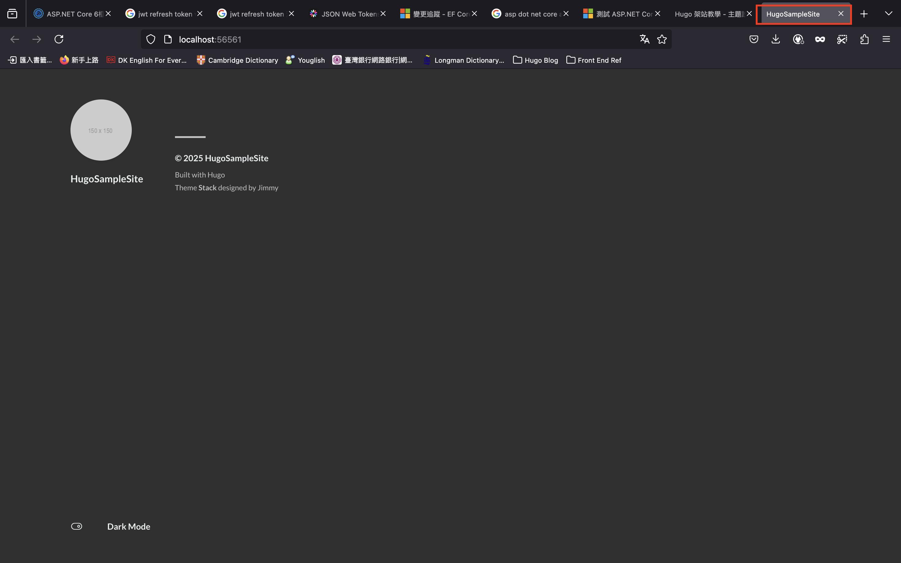
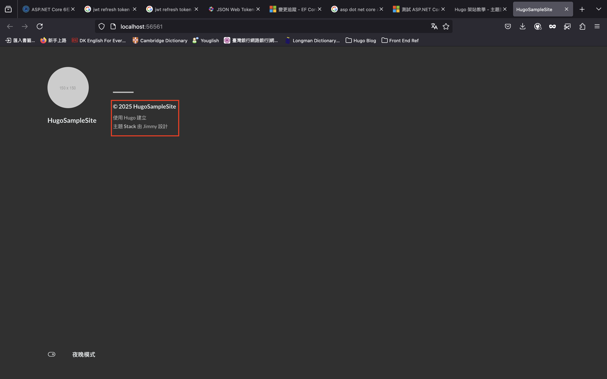
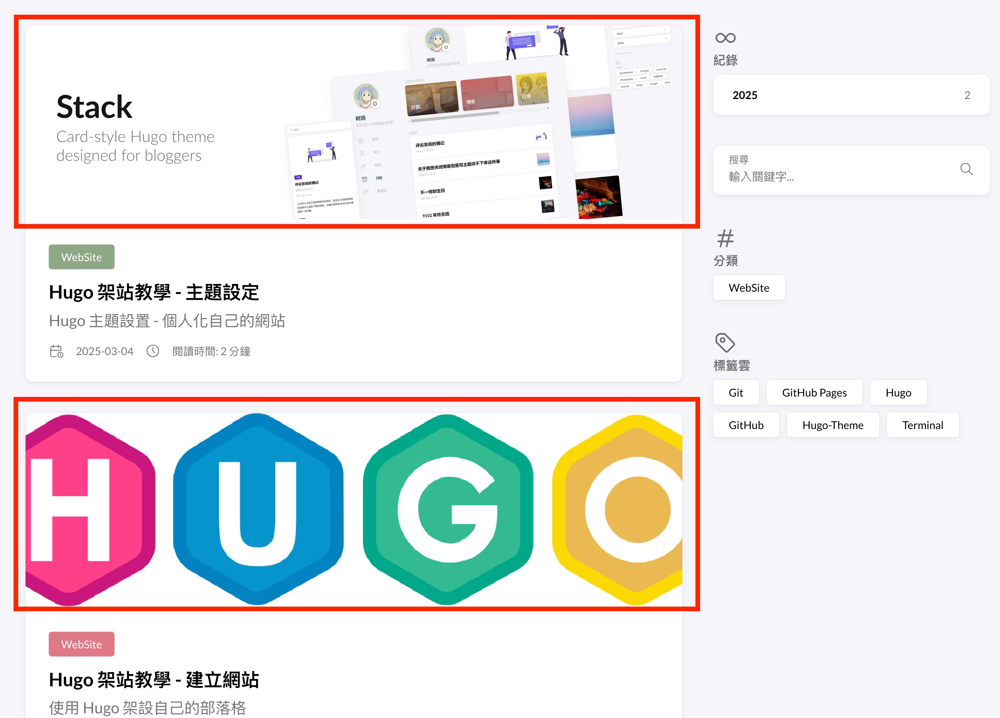
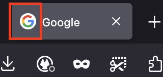
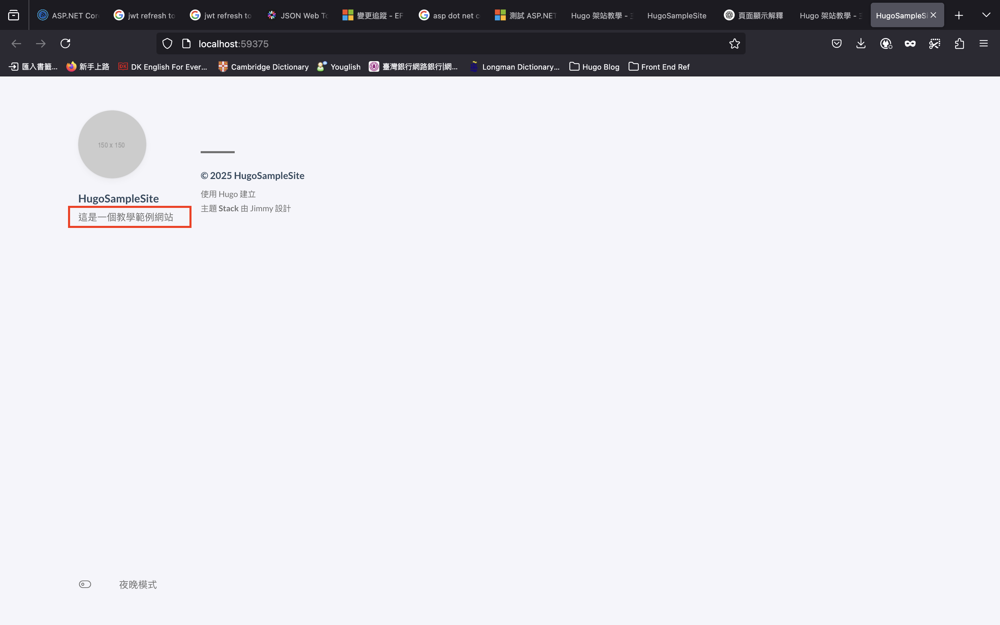
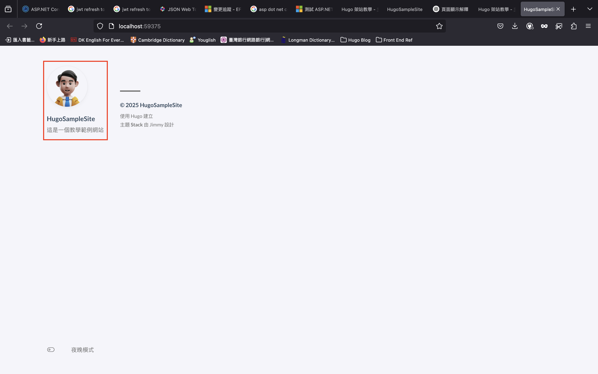
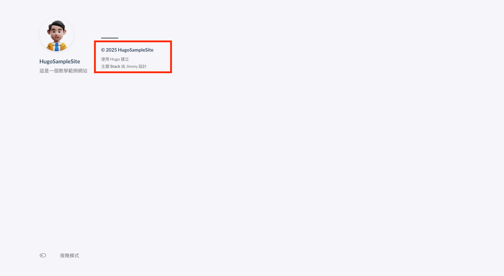
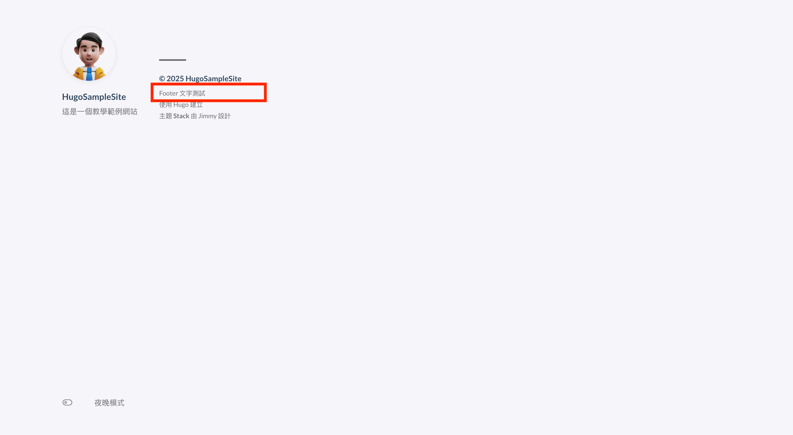
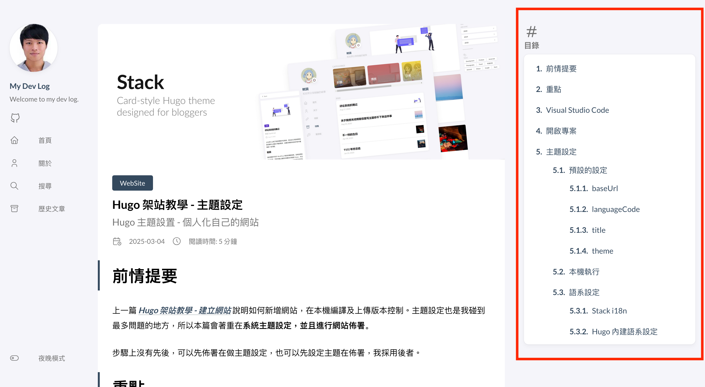

# 前情提要

上一篇 **_[Hugo 架站教學 - 建立網站](/posts/hugo-new-site-tutorial)_** 說明如何新增網站，在本機編譯及上傳版本控制。主題設定也是我碰到最多問題的地方，所以本篇會著重在**系統主題設定，並且進行網站佈署**。

步驟上沒有先後，可以先佈署在做主題設定，也可以先設定主題在佈署，我採用後者。

# 重點

1. 主題設定
2. 佈署網站

# Visual Studio Code

在配置 Hugo 主題前，需要一個編輯器來調整網站的相關設定。我推薦用 **_[Visual Studio Code（VS Code）](https://code.visualstudio.com/)_** 編輯檔案。它輕量、免費，支援 Markdown 和 TOML，適合 Hugo 專案。加裝 **_[hugo 相關套件](https://gohugo.io/tools/editors/)_** 擴充方便。但想使用其他編輯器也行。

# 開啟專案

1. 開啟 Visual Studio Code，開啟終端機「**control + `(數字 1 的左邊)**」


2. 切換 HugoSampleSite 目錄

```shell
cd Documents/HugoSampleCode
```

3. 開啟 HugoSampleCode 專案

**-r：reuse this window，使用目前的視窗**

**.：目前的目錄**

如果沒有 -r，vscode 會在新的視窗開啟專案，整行指令的意思是說，用目前 vscode 視窗開啟目前所在目錄檔案

```shell
code -r .
```


開啟後可以看到左邊 **檔案總管** 有完整的專案目錄

# 主題設定

主題設定參考下列兩個網站

1. **_[Hugo 官網](https://gohugo.io/)_**
2. **_[Stack 主題官網](https://stack.jimmycai.com/config/)_**

開啟目錄下的 `hugo.toml`，這個檔案就是網站的設定檔，開啟後會看到之前設定所套用的主題名稱。

```toml
theme = 'hugo-theme-stack'
```


到 **_[Stack 主題官網設定說明](https://stack.jimmycai.com/config/)_**，可以看到設定檔接受 3 種格式，可以選擇自己喜歡或習慣的格式來調整。

1. `TOML`：`.toml`
2. `YAML`：`.yaml`
3. `JSON`：`.json`

由於我比較習慣 yaml，所以我會先把 toml 轉成 toml，網路上有很多轉換工具，如 **_[https://transform.tools/toml-to-yaml](https://transform.tools/toml-to-yaml)_** 將設定檔內容做轉換，並將 `hugo.toml` 存成 `hugo.yaml`


## 預設的設定

建立網站時的初始設定

### baseUrl

網站的網址，本機開發不需要去改它，如果之後買自己的網址才需要去更改。

參考 **_[hugo baseUrl configuration](https://gohugo.io/getting-started/configuration/#baseurl)_**

### languageCode

網站的語系編碼，這個下面的設定會調整。參考 **_[語系設定](#語系設定)_**

### title

網站的標題，也就是**標籤上顯示的標題**，這邊改成 HugoSampleSite。

`hugo.yaml`

```yaml
title: HugoSampleSite
```

並在終端機將本機網站執行

```shell
hugo server
```



### theme

套用的主題名稱，前一篇已經知道了

## 本機執行

在改完設定後，可以直接儲存，不需要重新啟動本機伺服器，hugo 會即時渲染最新結果

如果想要結束本機執行，在終端機按下「**control + c**」

## 語系設定

下面有兩種設定方式可以擇一設定，如果設定了可以刪除初始的語系設定。

### Stack i18n

Stack 主題使用 **_[i18n](https://stack.jimmycai.com/config/i18n)_** 來設定網站的語系，在 `hugo.yaml` 加入繁體中文設定，儲存。
如果還在執行模式就可以切換到瀏覽器查看最新結果

```yaml
# 網站語系設定
# 參考 https://stack.jimmycai.com/config/i18n
DefaultContentLanguage: zh-tw
```



### Hugo 內建語系設定

在 **_[Hugo 內建的語系設定](https://gohugo.io/content-management/multilingual/)_** 會發現 languageCode 的設定結構不太一樣，如果有需要更細的設定或其他客製需求，可以把 **_[Configure languages](https://gohugo.io/content-management/multilingual/#configure-languages)_** 的設定值複製下來，改成中文設定。

相關設定如下

- disabled：不翻譯網站內容，預設是啟用翻譯功能
- languageCode：網頁內容語系編碼 zh-tw（臺灣繁體中文），你會發現上面初始設定有一個一樣的設定，可以刪除初始設定的語系。
- languageName：語言名稱
- title：可以針對這個語系設定標題
- weight：語系的排序
- languageDirection：文字閱讀方向，左到右或右到左，不需要可以刪除，採網頁預設的方向。

另外要注意的是，如果是用 Hugo 內建的語系設定方法，需要提供 **defaultContentLanguage** 這個設定，因為 Hugo 預設是英文，要將它設定成 **zh-tw**

```yaml
defaultContentLanguage: zh-tw
languages:
  zh-tw:
    disabled: false
    languageCode: "zh-tw"
    languageName: "中文"
    title: "示範網站"
    weight: 1
# 如果需要其他語系設定，可以再複製 zh-tw 再修改成其他語系
# en:
#   disabled: false
#   languageCode: "en"
#   languageName: "English"
#   title: "HugoSampleSite"
#   weight: 2
```

### 語系總結

最後設定完，設定檔 `hugo.yaml` 會長這樣，如果是用 Hugo 內建的設定要注意每個語系的結構，語系的最上層要對齊，跟 Python 一樣是用縮排在表示物件結構

```yaml
baseURL: https://example.org/
title: HugoSampleSite
theme: hugo-theme-stack
# 網站語系設定
# 參考 https://stack.jimmycai.com/config/i18n
DefaultContentLanguage: zh-tw
# 參考 https://gohugo.io/content-management/multilingual/#configure-languages
# 因為 Hugo 預設的系統語言是英文，所以需要將預設的語言改成中文
# defaultContentLanguage: zh-tw
# languages:
#   zh-tw:
#     disabled: false
#     weight: 1
#     languageCode: zh-tw
#     languageName: 中文
#     title: "示範網站"
```

這裡特別說明一下，我每做完一個設定就會上傳一個版本，你也可以等到所有設定都完成後一次上傳，上傳流程請參考上一篇 **_[第一版程式上傳](/posts/hugo-new-site-tutorial/#第一版程式上傳)_**，**如果要上版的話，請先結束執行中的網站「control + c」**，才有辦法上傳。

## Site-Wide 設定

參考 **_[Site-Wide settings](https://stack.jimmycai.com/config/site)_**

全站設定，會套用到整個網站，在 **params** 的下面，也就是說架構要像下面這樣

```yaml
params:
  # 其他相關設定
```

這裡不會全列出來，只說明幾個比較會用到的。

### mainSections

指首頁或文庫頁要呈現的內容，預設是 post，也就是 **post 目錄** 下的內容，因此可以將 po 文都放在 post 目錄下，可以改成自己想要的目錄，呈現自己想要的內容，範例用預設值就好

```yaml
params:
  mainSections: <dirname>
```

### featuredImageField

這個設定關係到 po 文，featuredImage 就是 po 文上面的縮圖



而 featuredImageField 就是 po 文上面的圖片，設定的欄位要叫什麼，預的名稱是 image

也就是說如果在 `hugo.yaml` 設定改成 img

```yaml
params:
  featuredImageField: img
```

那在 po 文的地方，想要加入縮圖的話就要變成下面這樣

index.md

```yaml
img: imgSrc
```

### favicon

就是網頁標籤左邊的縮圖，可以不設定



### Site-wide 總結

簡單來說上面的三項設定，都可以用預的值，所以 `hugo.yaml` 設定檔不變

## Date Format

參考 **_[Date format 設定](https://stack.jimmycai.com/config/date-format)_**

日期的格式設定，**需要放在 params 下面**，格式如下

```yaml
params:
  dateFormat:
    # 其它日期格式相關設定
```

這裡要特別注意，Hugo 是用 Go 語言寫出來的，所以要用的日期格式設定。
而 **Go 的日期與其他程式語言不同，不是用字串模版的產生的**

如 C#，yyyy（4 位數年份）、MM（2 位數月份，不足補 0）、dd（2 位數的日期，不足補 0）

```csharp
DateTime Now = DateTime.Now;

Console.WriteLine($"{Now:yyyy-MM-dd}");

// Output 2025-03-04
```

**Go 有一個固定的日期，一定要是 2006 年 1 月 2 日，下午 3 點 04 分 05 秒**，我原本以為是個隨意的日期，所以就設定成了架設網站當天的日期，結果 po 文的時間完全的錯的。
後來 Google 才知道原來這是故意設計的，上面的時間點會變成 **6 1 2 3 4 5** 沒有一個數字是重複的

### published

在 dateFormat 下面，po 文日期的呈現樣式設定（可以參考 featuredImage 那張圖，閱讀時間旁有 po 文的日期），這邊改成我比較熟悉的格式

```yaml
params:
  # 日期格式設定
  dateFormat:
    # po 文日期格式設定
    published: 2006-01-02
```

### lastUpdated

一樣在 dateFormat 下面，po 文最後更新時間格式的設定，在 dateFormat 下面加上，**T 用來分隔日期跟時間**，**+0800 是因為臺灣的時區是 GMT+8**

```yaml
# 最後更新時間格式設定
lastUpdated: 2006-01-02T15:04+0800
```

### Date format 總結

最後完成的設定檔如下

```yaml
baseURL: https://example.org/
title: HugoSampleSite
theme: hugo-theme-stack
# 網站語系設定
# 參考 https://stack.jimmycai.com/config/i18n
DefaultContentLanguage: zh-tw
# 參考 https://gohugo.io/content-management/multilingual/#configure-languages
# 因為 Hugo 預設的系統語言是英文，所以需要將預設的語言改成中文
# defaultContentLanguage: zh-tw
# languages:
#   zh-tw:
#     disabled: false
#     weight: 1
#     languageCode: zh-tw
#     languageName: 中文
#     title: "示範網站"

params:
  # 日期格式設定
  # 參考 https://stack.jimmycai.com/config/date-format
  dateFormat:
    # po 文日期格式設定
    published: 2006-01-02
    # 最後更新時間格式設定
    lastUpdated: 2006-01-02T15:04+0800
```

設定完成後，將程式上傳到 GitHub。

## Sidebar

參考 **_[Sidebar 設定](https://stack.jimmycai.com/config/sidebar)_**

左邊選單的相關設定，一樣放在 **params 下面**

### subtitle

在 sidebar 的下面，設定副標題，在網頁圖像下方標題的下方，有一行更小的文字

```yaml
params:
  # 左邊選單設定
  # 參考 https://stack.jimmycai.com/config/sidebar
  sidebar:
    # 設定網頁副標題
    subtitle: 這是一個教學範例網站
```

設定完成後，編譯並執行網站



### avatar

在 sidebar 下面，網站頭像設定

```yaml
params:
  sidebar:
    avatar:
      # avatar 相關設定
```

#### enabled

是否啟用頭像，預設是啟用

#### local

頭像是否是網站內的資源，預設是 **true**，也就是說如果你要用網路資源的話，要將這個值設成 **false**。

**如果使用預設值的話，需要將圖片檔案下載放到目錄下的 `assets/img` 資料夾，在編譯時會將 `img` 目錄帶過去 `public`，這樣下一個屬性才有辦法做用，千萬不要放在 `static/img`**

```yaml
params:
  sidebar:
    avatar:
      # 如果要用網路資源
      local: false
```

#### src

頭像的來源，預設是 `img/avatar.png`，如果上一設定設成 false，可以設成網路圖像的連結；反之，就要將圖片下載至 `assets/img` 目錄，沒有這個目錄的話，可以自已建

```yaml
params:
  sidebar:
    avatar:
      src: https://cdn3d.iconscout.com/3d/premium/thumb/boy-avatar-3d-icon-download-in-png-blend-fbx-gltf-file-formats--boys-male-man-pack-avatars-icons-5187865.png?f=webp
```

設定完成後，可以在 hugo server 中看執行的結果



### sidebar 總結

最後本教學是採用網路資源，設定檔完成後會變成下面

```yaml
baseURL: https://example.org/
title: HugoSampleSite
theme: hugo-theme-stack
# 網站語系設定
# 參考 https://stack.jimmycai.com/config/i18n
DefaultContentLanguage: zh-tw
# 參考 https://gohugo.io/content-management/multilingual/#configure-languages
# 因為 Hugo 預設的系統語言是英文，所以需要將預設的語言改成中文
# defaultContentLanguage: zh-tw
# languages:
#   zh-tw:
#     disabled: false
#     weight: 1
#     languageCode: zh-tw
#     languageName: 中文
#     title: "示範網站"

params:
  # 日期格式設定
  # 參考 https://stack.jimmycai.com/config/date-format
  dateFormat:
    # po 文日期格式設定
    published: 2006-01-02
    # 最後更新時間格式設定
    lastUpdated: 2006-01-02T15:04+0800
  # 左邊選單設定
  # 參考 https://stack.jimmycai.com/config/sidebar
  sidebar:
    # 設定網頁副標題
    subtitle: 這是一個教學範例網站
    # 設定網站頭像
    avatar:
      src: https://cdn3d.iconscout.com/3d/premium/thumb/boy-avatar-3d-icon-download-in-png-blend-fbx-gltf-file-formats--boys-male-man-pack-avatars-icons-5187865.png?f=webp
      local: false
```

這邊在上一版程式

## Footer

有寫過 HTML 的話應該會知道 footer，就是網頁最下方的區塊。

相關設定參考 **_[Footer Configuration](https://stack.jimmycai.com/config/footer)_**

結構上一樣是放在 **params** 的下面

```yaml
params:
  footer:
    # 其他 footer 的相關設定
```

我不打算改動它，直接用預設的就好，不過還是介紹一下。至於為什麼會在這麼上的位置，是因為目前還沒有任何的 po 文，而主題 footer 的設定應該不是固定在底部的，所以才會往跑。



### since

是網站創建的時間（年），以今年為例

```yaml
params:
  footer:
    since: 2025
```

### customText

想要在 footer 顯示的文字，可以是純文字，也可以是一段 HTML

```yaml
params:
  footer:
    customText: Footer 的文字測試
```



### Footer 總結

由於我沒有對 footer 設定進行更動，所以這邊不做版本上傳，有興趣的可以自己嘗試。

## Article

po 文相關的設定，可以參考 **_[Article configuration](https://stack.jimmycai.com/config/article)_**

結構如下

```yaml
params:
  article:
    # 其他 Article 相關設定
```

### math

Hugo 的 po 文是採用 [Markdown](https://markdown.tw/) 語法所寫出來的，最後在編譯成 HTML 檔案，而 Markdown 支援數學公式，**這個設定主要是開啟數學公式的支援，讓你可以在 po 文中寫數學公式**

不過我想一般的使用者應該不太有這個需求，所以就不特別做設定。

```yaml
params:
  article:
    math: true
```

### toc

全文是 table of content，就是目錄的意思，是否要顯示 po 文的目錄。**要特別注意的是，需要在之後的小工具也做一樣的設定，才會生效**。

```yaml
params:
  article:
    toc: true
```

以本篇為例



### readingTime

閱讀時間的顯示設定，預設是開啟的，所以可以不動，圖片可以參考目錄那張副標題下方有一個閱讀時間：5 分鐘，如果不想顯示在把它設定關閉。

```yaml
params:
  article:
    # 如果要不顯示閱讀時間
    readingTime: false
```

### license

授權的相關設定，也就是你是否要授權其他人轉載你的 po 文。預設是使用 **_[Licensed under CC BY-NC-SA 4.0](https://creativecommons.org/licenses/by-nc-sa/4.0/deed.zh-hant)_** 授權。

結構如下

```yaml
params:
  article:
    license:
      # 其他 license 相關設定
```

#### enabled

是否顯示授權條款的文字「Licensed under CC BY-NC-SA 4.0」，預設是不顯示的，但我把它打開

```yaml
params:
  article:
    license:
      # 顯示授權條款文字
      enabled: true
```

#### default

授權條款的文字，使用預設的就可以了，你也可以自己改成其它的條款文字，**_[條款參考](https://zh.wikipedia.org/zh-tw/%E7%9F%A5%E8%AF%86%E5%85%B1%E4%BA%AB%E8%AE%B8%E5%8F%AF%E5%8D%8F%E8%AE%AE)_**

```yaml
params:
  article:
    license:
      # 授權條款文字
      default: <其他授權條款文字>
```

### Article 總結

以上我們只有設定了 toc、license 的 enabled，其他不動。

```yaml
baseURL: https://example.org/
title: HugoSampleSite
theme: hugo-theme-stack
# 網站語系設定
# 參考 https://stack.jimmycai.com/config/i18n
DefaultContentLanguage: zh-tw
# 參考 https://gohugo.io/content-management/multilingual/#configure-languages
# 因為 Hugo 預設的系統語言是英文，所以需要將預設的語言改成中文
# defaultContentLanguage: zh-tw
# languages:
#   zh-tw:
#     disabled: false
#     weight: 1
#     languageCode: zh-tw
#     languageName: 中文
#     title: "示範網站"

params:
  # 日期格式設定
  # 參考 https://stack.jimmycai.com/config/date-format
  dateFormat:
    # po 文日期格式設定
    published: 2006-01-02
    # 最後更新時間格式設定
    lastUpdated: 2006-01-02T15:04+0800
  # 左邊選單設定
  # 參考 https://stack.jimmycai.com/config/sidebar
  sidebar:
    # 設定網頁副標題
    subtitle: 這是一個教學範例網站
    # 設定網站頭像
    avatar:
      src: https://cdn3d.iconscout.com/3d/premium/thumb/boy-avatar-3d-icon-download-in-png-blend-fbx-gltf-file-formats--boys-male-man-pack-avatars-icons-5187865.png?f=webp
      local: false
  # PO 文相關設定
  # 參考 https://stack.jimmycai.com/config/article
  article:
    # 文章目錄：開啟
    toc: true
    license:
      # 顯示授權條款文字
      enabled: true
```

最後再上一版程式
