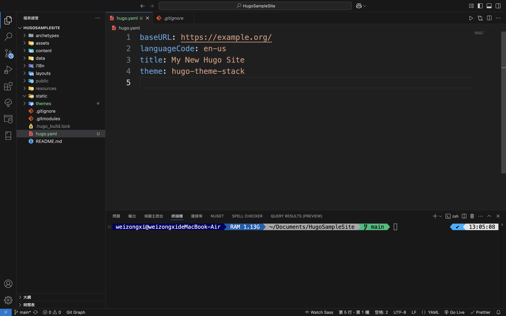

# 前情提要

上一篇 **_[Hugo 架站教學 - 建立網站](/posts/hugo-new-site-tutorial)_** 說明如何新增網站，在本機編譯及上傳版本控制。主題設定也是我碰到最多問題的地方，所以本篇會著重在**系統主題設定，並且進行網站佈署**。

步驟上沒有先後，可以先佈署在做主題設定，也可以先設定主題在佈署，我採用後者。

# 重點

1. 主題設定
2. 佈署網站

# Visual Studio Code

在配置 Hugo 主題前，需要一個編輯器來調整網站的相關設定。我推薦用 **_[Visual Studio Code（VS Code）](https://code.visualstudio.com/)_** 編輯檔案。它輕量、免費，支援 Markdown 和 TOML，適合 Hugo 專案。加裝 **_[hugo 相關套件](https://gohugo.io/tools/editors/)_** 擴充方便。但想使用其他編輯器也行。

# 開啟專案

1. 開啟 Visual Studio Code，開啟終端機「**control + `(數字 1 的左邊)**」


2. 切換 HugoSampleSite 目錄

```shell
cd Documents/HugoSampleCode
```

3. 開啟 HugoSampleCode 專案

**-r：reuse this window，使用目前的視窗**

**.：目前的目錄**

如果沒有 -r，vscode 會在新的視窗開啟專案，整行指令的意思是說，用目前 vscode 視窗開啟目前所在目錄檔案

```shell
code -r .
```


開啟後可以看到左邊 **檔案總管** 有完整的專案目錄

# 主題設定

主題設定參考下列兩個網站

1. **_[Hugo 官網](https://gohugo.io/)_**
2. **_[Stack 主題官網](https://stack.jimmycai.com/config/)_**

開啟目錄下的 `hugo.toml`，這個檔案就是網站的設定檔，開啟後會看到之前設定所套用的主題名稱。

```toml
theme = 'hugo-theme-stack'
```


到 **_[Stack 主題官網設定說明](https://stack.jimmycai.com/config/)_**，可以看到設定檔接受 3 種格式，可以選擇自己喜歡或習慣的格式來調整。

1. `TOML`：`.toml`
2. `YAML`：`.yaml`
3. `JSON`：`.json`

由於我比較習慣 yaml，所以我會先把 toml 轉成 toml，網路上有很多轉換工具，如 **_[https://transform.tools/toml-to-yaml](https://transform.tools/toml-to-yaml)_** 將設定檔內容做轉換，並將 `hugo.toml` 存成 `hugo.yaml`


