# 前情提要

終於來到 Hugo 架站 3 部曲的最後一部了，前兩篇說明了「建立網站」、「設定主題」但沒有網站內容，本篇會聚焦在 po 文撰寫，一步步豐富部落格，完成架設網站的最後一片拼圖。

# 本篇重點

1. Markdown
2. Front Matter
3. PO 文目錄架構

# Markdown

**_[Markdown](https://zh.wikipedia.org/zh-tw/Markdown)_** 是 Hugo 頁面和文章的基礎所有的頁面和創作內容，都要使用它，並在最後透過 Hugo 的編譯器，將 Markdown 編成 HTML。

## Hugo 的 Markdown 語法

基本用法，可以在 **_[Markdown Playground](https://dotmd-editor.vercel.app/)_** 測試結果

1. 標題
2. 清單（編號、無編號）
3. 程式碼區塊
4. 字型樣式（粗體、斜體）
5. 超連結
6. 圖片

### 標題

用「#」表示標題，通常只會用到 h2 ~ h4，因為 Hugo 預設只會顯示，\#\# ~ \#\#\#\# 的標題，如果要像我一樣顯示 \# 的標題需要在設定檔中額外設定

```markdown
# h1 標題

## h2 標題

### h3 標題

#### h4 標題

##### h5 標題

###### h6 標題
```

### 清單

使用「-」產生無編號清單，「-」與文字間要有一個空格（空白鍵）；使用「數字」產生有編號清號，與文字一樣需要空一格。

- 項目一
- 項目二
- 項目三

1. 編號 1
2. 編號 2
3. 編號 3

```markdown
- 項目一
- 項目二
- 項目三

1. 編號 1
2. 編號 2
3. 編號 3
```

### 程式碼區塊

使用「**\`\`\`**」共 3 個「\`（數字 1 號鍵左邊）」，然後接程式語言的名稱不需要空一格，如 \`\`\`Javascript，最後在要結束的地方在用三個\`\`\`表示結束。

\`\`\`javascript \
console.log("Hello world");\
\`\`\`

```javascript
console.log("Hello world");
```

### 字型樣式

有兩種

1. 粗體：兩個星號「\*\*」
2. 斜體：一個底線「\_」
3. 粗斜體：1 + 2\
   把要套用的字包起來

**粗體 - 兩個星號**\
_斜體 - 一個底線_\
**_粗斜體 - 兩個星號一個底線_**

```markdown
**粗體 - 兩個星號**
_斜體 - 一個底線_
**_粗斜體 - 兩個星號一個底線_**
```

### 超連結

**\[超連結顯示的文字\]\(連結網址\)**，以 Google 為例\
[Google](https://www.google.com/)

```markdown
[Google](https://www.google.com/)
```

### 圖片

跟超連結很像，在最前面加上「!」而已\
**\!\[圖片載入失敗要顯示的文字\]\(圖片網址\)**\
以套用的主題圖片為例


```markdown

```

## Markdown 實踐

上面紹介的幾個是寫文章比較常用到的，現在利用上一篇所產生的關於頁面來寫部落格的第一個內容。

※ Markdown 其實還有很多語法，不過 Hugo 沒有全部支援，使用上面幾個應該就夠了，其它寫法可以自己研究

開啟 vscode 再開啟 `content/page/about/index.md`，會看到之前寫好的內容，「**- - -**」包起來的內容叫 **Front Matter**，就是 About 這一頁的設定，下面的章結會介紹，本節主要是 Markdown 語法

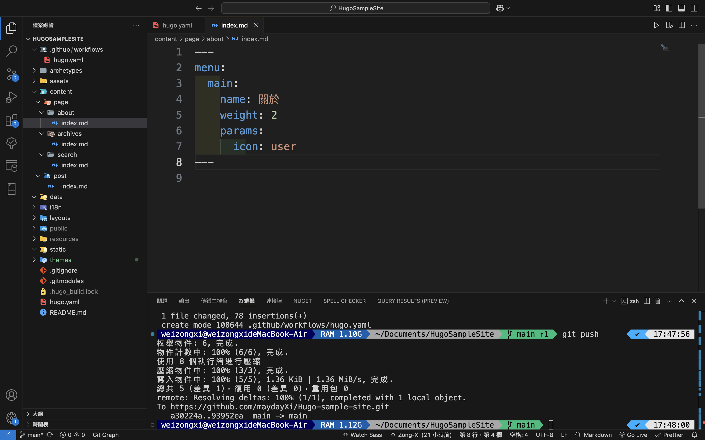

### 新增標題及內容

```markdown
## 關於

這是一個使用 Hugo 建立的範例網站，作為教學用，主要在幫助使用者了解 Hugo 的基本操作及功能，並一步步建立網站，設定主題。無論是新手或有經驗的開發者，這個網站都可以作為一個參考，並且讓你實際建立出自己的網站。
```

將「教學用」改為粗體後儲存

```markdown
**教學用**
```

接著運行網站，在終端機輸入，網站啟動

```shell
hugo server
```

在左邊選單點擊「關於」，看結果

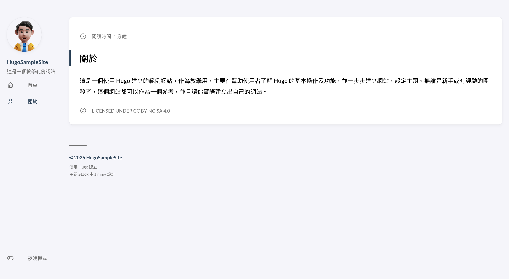

### 新增主題段落

這裡會注意到網站有設定顯示目錄，但是目錄沒有出現，這是因為這個主題的設定，**要有兩個以上的二級標題才會顯示目錄**，所以我目在新增一個主題的段落。

```markdown
## 網站主題

網站主題套用 Hugo-Theme-Stack
```

#### 加入超連結

這邊把「Hugo-Theme-Stack」改成超連結，並貼上超連結網址「https://themes.gohugo.io/themes/hugo-theme-stack/」

```markdown
[Hugo-Theme-Stack](https://themes.gohugo.io/themes/hugo-theme-stack/)
```

Hugo 是即時渲染，只要在網站執行的情況下，儲存後網站就會是最新的狀態，不需要重新執行，所以直接切回瀏覽器就可以看到最新結果，可以看到因為有 2 個段落了，所以目錄出現了，接著可以點擊超連結確認是否會連到主題的網站。

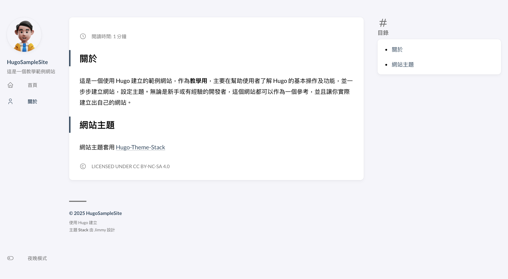

#### 改變超連結字型樣式

這一步可以不用做，但如果覺得超連結不夠醒目，可以再變成粗體或斜，範例示範粗斜體

```markdown
**_[Hugo-Theme-Stack](https://themes.gohugo.io/themes/hugo-theme-stack/)_**
```


#### 加入主題圖片

接下來加入主題的圖片，網址「https://user-images.githubusercontent.com/5889006/190859441-141b5f81-8483-40d2-bd96-ebf85616a46d.png」，用 **\[圖片載入失敗顯示的文字\]\(圖片的連結\)**\
要特別注意 **Markdown 語法兩個 Enter 會渲染成一個換行，所以要跟上面的連結空一行**

```markdown
<!-- 假設這裡是超連結 -->


```

儲存後切回瀏覽器會看到主題圖片出現了

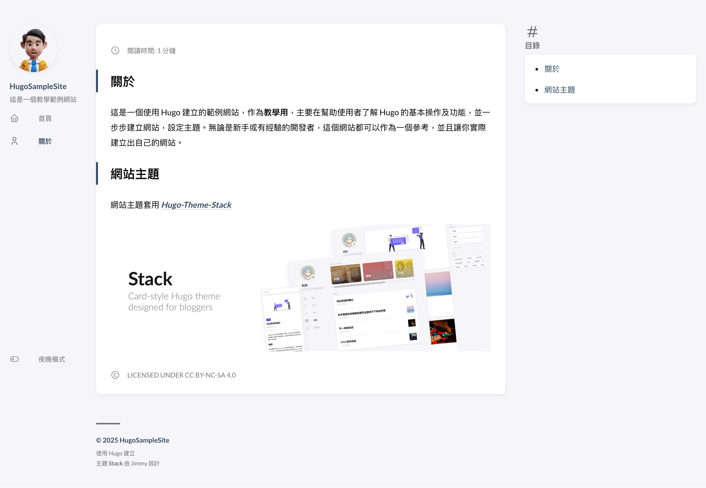

### 新增參考網站段落

最後新增「參考網站」的區塊，練習清單做法，下面加入 4 個參考網站，可以選擇使用編號或不編號的清單，這裡示範編號清單

1. Hugo 的官方網站：https://gohugo.io/
2. Theme 的官方網站：https://stack.jimmycai.com/
3. Theme 的 GitHub：https://github.com/CaiJimmy/hugo-theme-stack/tree/master
4. 本網站的 GitHub：https://github.com/maydayXi/Hugo-sample-site

```markdown
## 參考網站

1. [Hugo 官方網站](https://gohugo.io/)
2. [Hugo-Theme-Stack 官方網站](https://stack.jimmycai.com/)
3. [Hugo-Theme-Stack GitHub](https://github.com/CaiJimmy/hugo-theme-stack/tree/master)
4. [HugoSampleSite](https://github.com/maydayXi/Hugo-sample-site)
```

切回瀏覽器後就會看到清單項目編號出現，Markdown 語法綀習就到這邊。

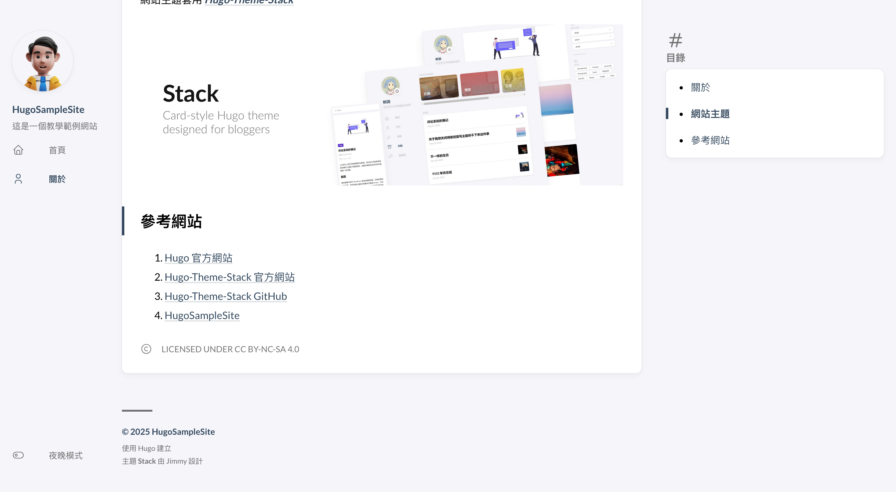

### 關於的 FrontMatter

Markdown 寫完後，基本上你已經可以寫出一頁網頁了，不過你會發現只有閱讀時間的資訊，在 **_[Markdown 實踐](#markdown-實踐)_** 有提到 Front Matter，這些頁面上的資訊，其實就是 Front Matter 做出來的，這邊先說明其中常用的 3 個，接著套用的關於這一頁上

1. **title：這一頁的標題，不是內文的標題**
2. **date：這一頁建立的時間**
3. **description：這一頁的副標題**

參考下面進行相關設定，**要特別注意 Front Matter 區塊一定要在最上面，然後用 3 個「-」號包起來**

```markdown
---
title: 關於本站
date: 2025-03-06
description: 網站的簡介
# 上一篇建立的選單連結
menu:
  main:
    name: 關於
    weight: 2
    params:
      icon: user
---

<!-- 其它標題及內容 -->
```

設定完後儲存，切回瀏覽器，就會看到出現了相關的頁面資訊，關於就完成了，可以結束執行並上傳程式版本到 GitHub，並觀察佈署的情況，確認佈署完後驗證網頁是否有上傳成功。

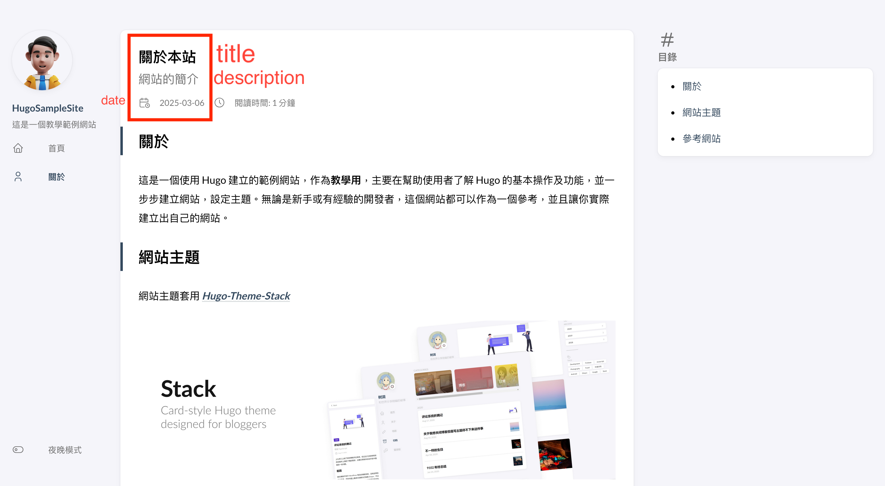

## Front Matter

接下來要詳細的說明 Front Matter，第一篇建立網站的時候，有一個網頁設定檔 `hugo.yaml`，**所以可以把 Front Matter 想成是單一網頁的設定檔，而它也有特定的格式，預設是 toml（用 +++ 區隔），但也可以改成 yaml（用- - - 區隔），由於是寫在 Markdown 檔案中，所以要區隔開來**，因為我比較的慣用 yaml，所以之後都會用 yaml 的格式寫

### Front Matter 預設值

每使用 **hugo new content** 新增一篇 PO 文，都會看到檔案中有預設的設定，這是可以改的，在網站的 `archetypes/default.md` 檔，開啟後就會看到預設的設定

```markdown
+++
date = '{{ .Date }}'
draft = true
title = '{{ replace .File.ContentBaseName "-" " " | title }}'
+++
```

先把它改成下面的樣子，讓它變成 `yaml` 的格式

```markdown
---
date: "{{ .Date }}"
draft: true
title: '{{ replace .File.ContentBaseName "-" " " | title }}'
---
```

這裡先說明一個屬性 **draft** 就是草稿，**hugo 不會產生出草稿狀態的網頁**，所以如果想要發佈某個文章的話，需要將它改成 **false**，下面設定讓它一開始就不是草稿狀態

```markdown
date: "{{ .Date }}"
draft: false
title: '{{ replace .File.ContentBaseName "-" " " | title }}'
```

### Front Matter 其他設定

再來看看其它設定，下面說明我常用到的 3 個

1. **categories： PO 文的分類**
2. **tags: PO 文的標籤**
3. **image: PO 文的縮圖**

可以發現上面這三個設定，在上一篇主題設定裡也有相關的設定，**其中第 3 個 image 對應到的就是在 `hugo.yaml` 中的 featuredImageField**

接下來將上面的 3 個設定寫入 `default.md` 裡，預設都先不給值，因為在寫 PO 文的時候才會知道文章要分在哪一類，給哪一個標籤。

```markdown
---
date: "{{ .Date }}"
draft: false
title: '{{ replace .File.ContentBaseName "-" " " | title }}'
categories:
tags:
image:
---
```

當然也可以添加其他設定，可以參考 **_[Front Matter Overview](https://gohugo.io/content-management/front-matter/#overview)_**，好了就可以儲存了，接著就要開始寫第一篇 PO 文了。這裡我再一次上版。

# 第一篇 PO 文

接著我們以「介紹 Hugo」這個題材為為第一篇貼文，貼文統一放在 `content/post` 目錄
在 Visual Studio Code 開啟終端機，輸入 **hugo new content**

```shell
hugo new content content/post/what-is-hugo/index.md
```

開啟剛剛新增的 `index.md` 檔案，如果有看到 Front Matter 預設跟上一節設定的一樣，就表示 Front Matter 的設定有成功

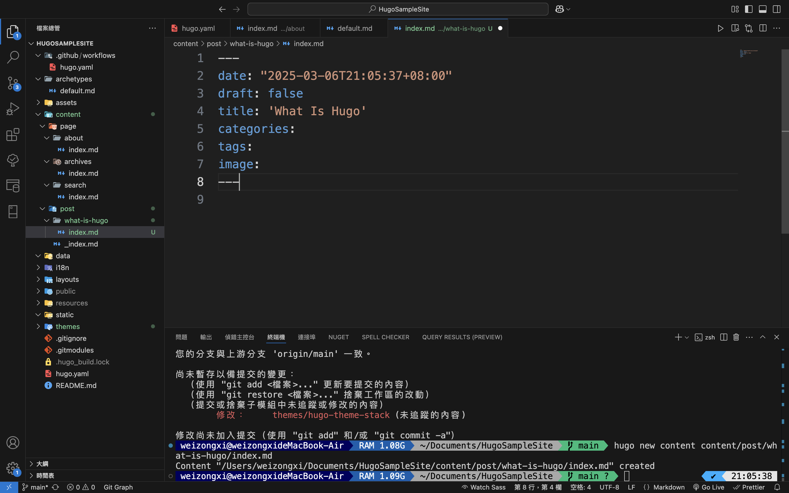

## 設定 Front Matter

我們需要**設定貼文的標籤跟分類及副標題，日期會自動套用新增這個檔案的時間，標題會自動套用這個檔案的名稱，所以如果要改標題再修改**

- 分類：因為是技術相關，所以設成「**Tech**」
- 標籤：**Hugo、Markdown**，因為是介紹 Hugo 為主題，而 Hugo 使用 Markdown 篇寫貼文及頁面

這裡說明一下分類跟標籤的差別\
**分類通常是範圍比較大的**，如技術、管理、商業，所以分類通常會設定比較少（1 ~ 2 個分類）\
**標籤通常是範圍比較小的**，如什麼樣的技術，什麼樣的工具，所以標籤會設定比較多

由於分類及籤都可以設定多個值，所以每一個值要使用「**-**」開頭，包在相關設定的下方

```markdown
---
date: "2025-03-06T21:05:37+08:00"
draft: false
title: "What Is Hugo"
categories:
  - Tech
tags:
  - Hugo
  - Markdown
image:
---
```

再來設定貼文的縮圖，在網路上找免費使用的圖庫，下載一張到這個貼文所在的目錄 `content/post/what-is-hugo`，這樣貼文才會讀得到

## Page Bundle

這邊要介紹 Hugo 的打包方式，有兩種，可以參考 **_[Hugo Page Bundle](https://gohugo.io/content-management/page-bundles/#article)_**

1. **leaf bundle：給單一網頁使用的**，像是一般的貼文，或是「關於」單一的介紹頁面，這類型的**網頁圖片也需要放在同一個目錄下，而它的頁面檔案名稱一定要是「`index.md`」**

2. **branch bundle：一個頁面下含有其他子網頁，像我們的首頁，可以看到很多貼文，可以在點某一個貼文進來瀏覽貼文內谷。這種類的檔案名稱一定要是「`\_index.md`」，這也是我們上一篇在建立首頁時檔案名稱一定要加「\_」的原因，也因為他可以有其他子網頁的原因，所以可以在包含其他目錄**

上一篇主題設定的地方，有一個設定是 **mainSections，預設是 post，所以會呈現 post 下的 `_index.md` 或 `index.md`** 但我們希望首頁可以有多個貼文讓使用者瀏覽，所以才會新增 `_index.md` 的檔案並且只設定 menu 並沒有設定其他內容

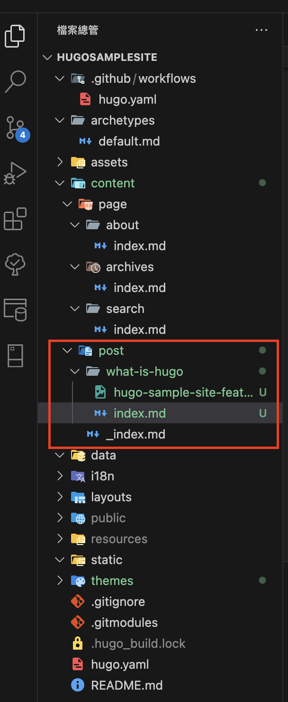

從上面的目錄可以看得出來，如果要在新增第二篇貼文，就要在 `post/` 目錄下新增另一個目錄（如：`second-post`），在 `second-post` 目錄下新增 `index.md` 檔案及相關資源

圖片下載到跟貼文一樣的目錄後，在 **image:** 加上圖片的檔名，儲存後執行網站

```markdown
image: "image-file-name.png"
```

會看到縮圖跟 Tech 分類都出現了，接著點進貼文

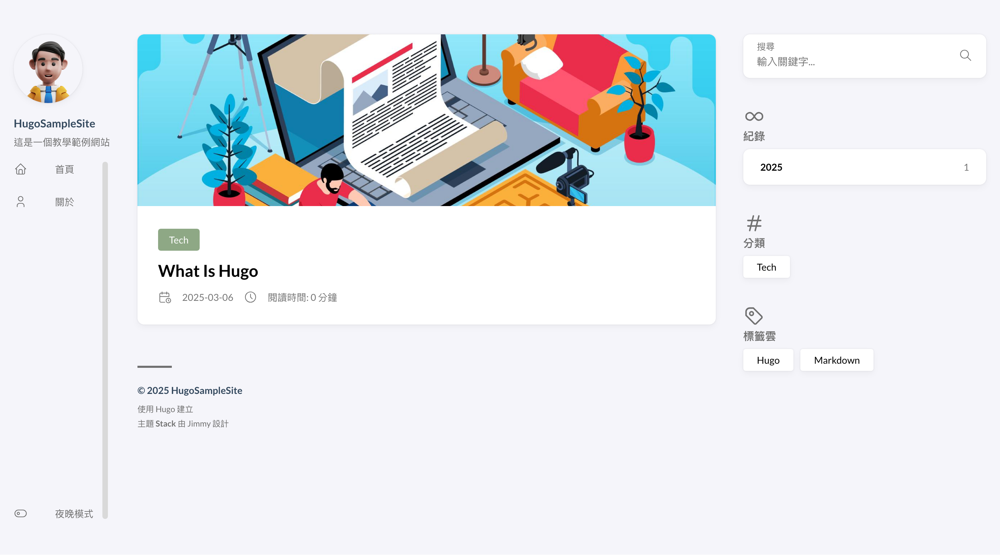

會看到貼文最上方有縮圖，最下方有標籤，當然現在沒有任何內容所以沒有目錄，接下來開始新增內容

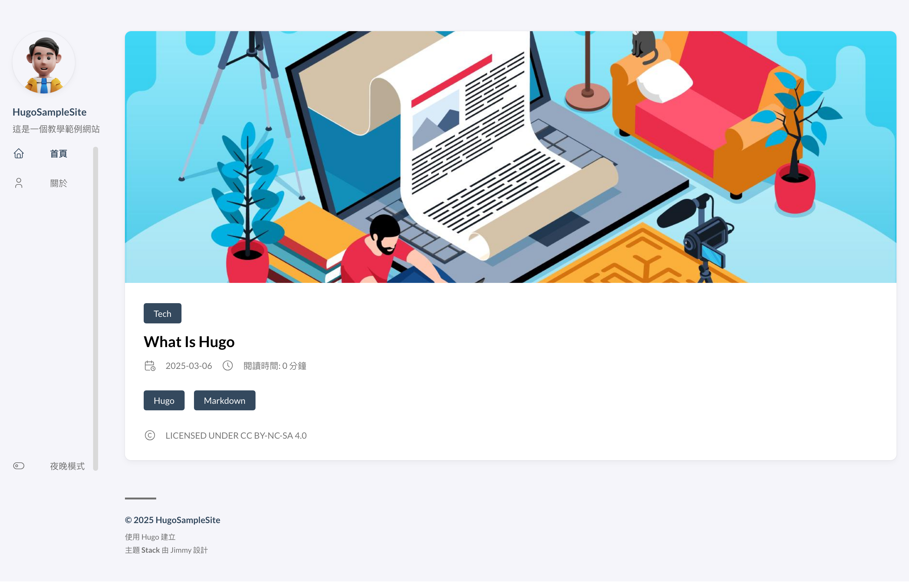

## 第一段「Hugo 是什麼」

新增一個二級標題「Hugo 是什麼？」開頭，接著新增簡介如下\
Hugo 是一款以 **Go 語言開發的靜態網站產生器（Static Site Generator, SSG）**，以 **快速、輕量** 著稱，**適合部落格、文件網站、個人作品集**等用途。

```markdown
## Hugo 是什麼

Hugo 是一款以 **Go 語言開發的靜態網站產生器（Static Site Generator, SSG）**，以 **快速、輕量** 著稱， **適合部落格、文件網站、個人作品集** 等用途。
```

### 新增「為什麼選擇 Hugo」

在第一段下方新增 3 級標題「為什麼選擇 Hugo」

```markdown
### 為什麼選擇 Hugo
```

#### 新增無編號清單項目

在 3 級標題下新增 6 個無編號清單項目，並且將項目標題粗體化如下

- **超高速編譯**：Hugo 只需毫秒級的時間即可重新生成整個網站。
- **單一執行檔**：無需額外安裝繁瑣的依賴套件。
- **Markdown 支援**：讓你能夠專注於內容創作。
- **內建開發伺服器**：支援即時預覽，提升開發效率。
- **靈活的內容管理**：可透過 `content/` 目錄組織內容。

```markdown
- **超高速編譯**：Hugo 只需毫秒級的時間即可重新生成整個網站。
- **單一執行檔**：無需額外安裝繁瑣的依賴套件。
- **Markdown 支援**：讓你能夠專注於內容創作。
- **內建開發伺服器**：支援即時預覽，提升開發效率。
- **靈活的內容管理**：可透過 `content/` 目錄組織內容。
```

#### 新增 Hugo 官方網站超連結

在項目清單的下方空一行並新增官方網站超連結「https://gohugo.io/」如下

```markdown
更多詳細資訊可以參考 **_[Hugo 官方網站](https://gohugo.io/)_**
```

## 第二段「Hugo 的核心功能」

新增第二個二級標題「Hugo 的核心功能」並輸入下面的內容

```markdown
## Hugo 的核心功能

Hugo 提供許多強大的功能，使開發靜態網站變得簡單且高效。
```

### 新增四個 3 級標題

新增四個 3 級標題

1. 內容管理系統
2. 強大的模板系統
3. 多語系支援
4. SEO 友善

並輸入內容如下

```markdown
### 內容管理系統

Hugo 採用 **Front Matter（前置資料）**，支援 YAML、TOML 和 JSON 格式，讓你可以自訂每篇文章的標題、日期、分類等屬性。

### 強大的模板系統

Hugo 使用 Go 的模板語法來建立頁面，並內建 `layouts/` 目錄讓開發者自訂樣板。

### 多語系支援

Hugo 內建國際化功能，可以輕鬆建立多語系網站。

### SEO 友善

Hugo 預設提供 **靜態網址、meta 標籤管理、站點地圖** 等功能，幫助網站在搜尋引擎上獲得更好的排名。
```

### 新增介紹影片

在第四個 3 級標題下方空一行，新增說明並加入介紹影片\
新增影片的語法是 **\{\{\<youtube ID\>\}\}**，影片 id 是 Youtube **網址最後 `?v=` 後的一串亂碼**\
我找到的 Id 是 `0RKpf3rK57I`
如下

```markdown
你可以觀看這部影片來更深入了解 Hugo：

<!-- youtube 的嵌入語法會渲染出來，應該是 bug，請用上面的文字自行更改 -->
```

## 第三段「Hugo 主題介紹」

新增第三個 2 級標題「Hugo 主題介紹」，並輸入下面的內容

```markdown
## Hugo 主題介紹

Hugo 有大量 **免費與開源的主題** 可供選擇，能夠快速讓網站呈現專業的外觀。
```

### 新增「如何選擇適合的 Hugo 主題？」

在第三段下新增一個 3 級標題「如何選擇適合的 Hugo 主題？」，並加入 3 個編號清單如下

1. 瀏覽官方主題庫：Hugo Themes
2. 考慮需求：是否需要部落格、作品集、文件網站等功能？
3. 測試與自訂：下載後可以透過 config.toml 來調整主題設定。

將 **Hugo Theme** 超連結並粗體化，網址「https://themes.gohugo.io/」

```markdown
1. 瀏覽官方主題庫：**[Hugo Themes](https://themes.gohugo.io/)**
2. 考慮需求：是否需要部落格、作品集、文件網站等功能？
3. 測試與自訂：下載後可以透過 config.toml 來調整主題設定。
```

### 新增「熱門的主題推薦」

在第三段中新都第二個 3 級標題，「熱門主題推薦」，以無項目清單列出主題網站中的前三名
並加入圖片，**下面示範以圖片網址的方式載入圖片，也可以將圖片下載到自己的貼文目錄下綀習 page bundle 的載入方法**

```markdown
### 熱門的主題推薦

- PaperMod

  

- Hugo Blox - Tailwind

  

- Stack

  
```

## 第一篇 PO 文總結

完成後的結果會像下面這樣

```markdown
---
date: "2025-03-06T21:05:37+08:00"
draft: false
title: "What Is Hugo"
categories:
  - Tech
tags:
  - Hugo
  - Markdown
image: hugo-sample-site-featured-image.jpg
---

## Hugo 是什麼

Hugo 是一款以 **Go 語言開發的靜態網站產生器（Static Site Generator, SSG）**，以 **快速、輕量** 著稱， **適合部落格、文件網站、個人作品集** 等用途。

### 為什麼選擇 Hugo

- **超高速編譯**：Hugo 只需毫秒級的時間即可重新生成整個網站。
- **單一執行檔**：無需額外安裝繁瑣的依賴套件。
- **Markdown 支援**：讓你能夠專注於內容創作。
- **內建開發伺服器**：支援即時預覽，提升開發效率。
- **靈活的內容管理**：可透過 `content/` 目錄組織內容。

更多詳細資訊可以參考 **_[Hugo 官方網站](https://gohugo.io/)_**

## Hugo 的核心功能

Hugo 提供許多強大的功能，使開發靜態網站變得簡單且高效。

### 內容管理系統

Hugo 採用 **Front Matter（前置資料）**，支援 YAML、TOML 和 JSON 格式，讓你可以自訂每篇文章的標題、日期、分類等屬性。

### 強大的模板系統

Hugo 使用 Go 的模板語法來建立頁面，並內建 `layouts/` 目錄讓開發者自訂樣板。

### 多語系支援

Hugo 內建國際化功能，可以輕鬆建立多語系網站。

### SEO 友善

Hugo 預設提供 **靜態網址、meta 標籤管理、站點地圖** 等功能，幫助網站在搜尋引擎上獲得更好的排名。

你可以觀看這部影片來更深入了解 Hugo：

<!-- youtube 影片嵌入語法 -->

## Hugo 主題介紹

Hugo 有大量 **免費與開源的主題** 可供選擇，能夠快速讓網站呈現專業的外觀。

1. 瀏覽官方主題庫：**[Hugo Themes](https://themes.gohugo.io/)**
2. 考慮需求：是否需要部落格、作品集、文件網站等功能？
3. 測試與自訂：下載後可以透過 config.toml 來調整主題設定。

### 熱門的主題推薦

- PaperMod

  

- Hugo Blox - Tailwind

  

- Stack

  
```

接著就可以儲存看執行結果了

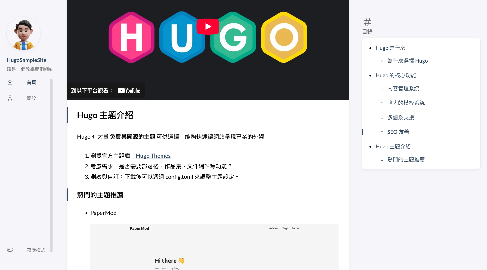

確認沒有問題後，就可以結束執行並進行最後一版程式上版了。

在上傳的時候，可能會碰到一個問題，**如果有圖片是第一次上傳的話容易出現錯誤，因為 git 預設的上傳大小只有 1mb，所以如果圖片超過這個大小的話會上傳失敗，請用下面的語法將上傳的容量提到 10 mb**

```shell
git config http.postBuffer 10485760
```

最後在終端機輸入指令上傳並佈署

```shell
git add .
git commit -m "Add first post"
git push
```

# 後記

恭喜各位順利完成這一步，看完了 Hugo 架站三部曲，希望可以幫助你了解 Hugo，並且利順架出自己網站，如果有任何問題，歡迎在下方留言討論，祝福大家打造出屬於自己的完美網站
