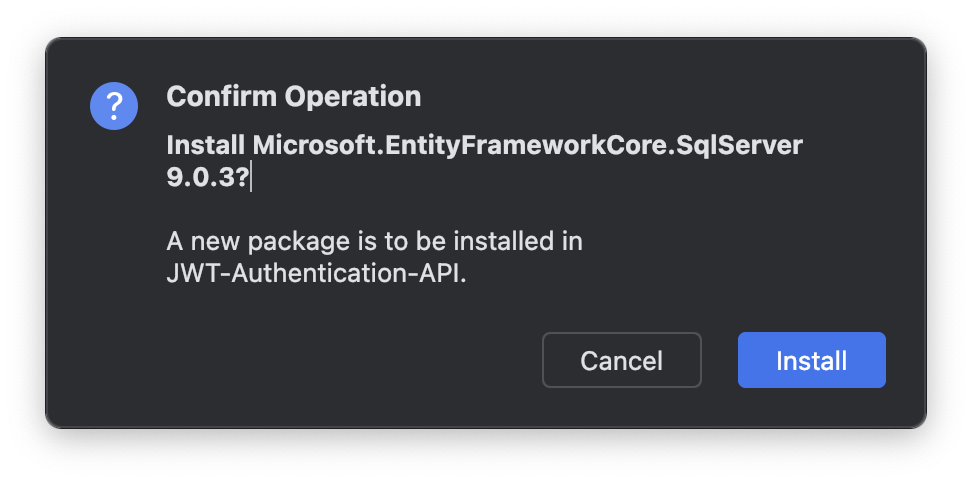
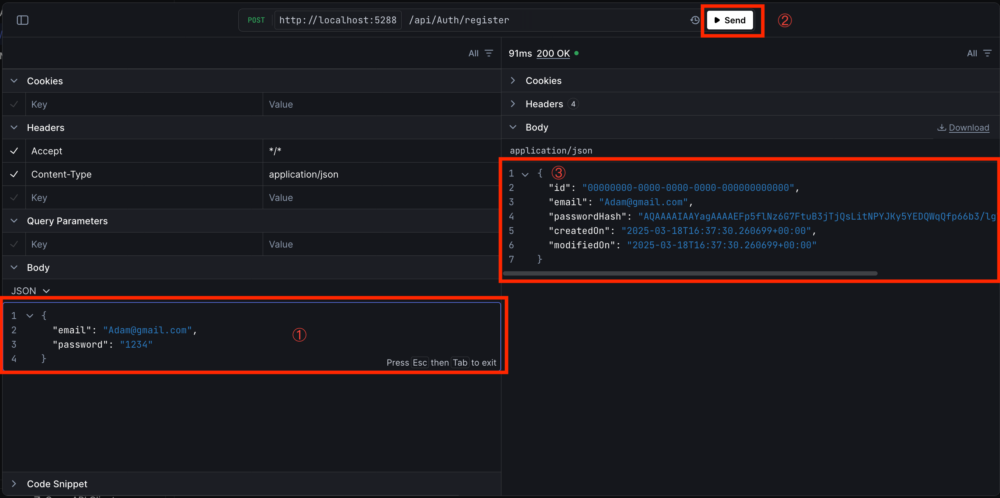

# 為什麼會寫這一篇

在開發 ASP.NET Core Web API 時，JWT（JSON Web Token）是一種常見的認證方式。然而，在 Google 搜尋相關教學時，我發現大多數的範例都使用 **_[ASP.NET Core Identity](https://learn.microsoft.com/zh-tw/aspnet/core/security/authentication/identity?view=aspnetcore-9.0&tabs=visual-studio)_**，但在企業內部系統中，很多公司會使用 **自行設計權限與認證機制**，在我的經驗中，**系統登入/登出** 是非常常見的功能，因此我想結合我的經驗實作一個 JWT 的認證。如果你希望在 ASP.NET Core Web API 中自行管理 JWT 認證，這篇文章會是一個不錯的參考。

# 本篇重點

- **Rider**
- **JWT（JSON Web Token）**
- **Entity Framework Core**
- **登入/登出/註冊**
- **Web API（Application Programming Interface）**

# 閱讀說明書

本篇適合

1. 有 **_[C#](https://dotnet.microsoft.com/zh-tw/languages/csharp)_** 基礎
2. 有 **_[JSON](https://developer.mozilla.org/zh-TW/docs/Learn_web_development/Core/Scripting/JSON)_** 基礎
3. 有 **_[API](https://aws.amazon.com/tw/what-is/api/)_** 基礎知識
4. 有 **_[ASP.NET Core(MVC)](https://learn.microsoft.com/zh-tw/aspnet/core/introduction-to-aspnet-core?view=aspnetcore-9.0)_** 基礎

# JWT（JSON Web Token）

JWT 全名是 JSON Web Token，是一種 **輕量級的認證與授權機制**，**常用於 Web API 的身份驗證**。它是一種 **基於 Token 的驗證方式**，不需要在伺服器端維護使用者的登入狀態，適合 **無狀態（stateless）** 應用，例如 RESTful API。

## 無狀態（stateless）

指 **伺服器不會記住客戶狀態**，**使用者登入的資訊會記錄在客戶端的瀏覽器（使用 Cookie）**

與之相對的就是 **有狀態（stateful）**，早期 JSON 還沒發成熟時，很多系統會 **將使用者登入資訊記錄在伺服器（使用 Session）來進行身份驗證**，由於資料都是記錄在伺服器，所以容易造成伺服器運算效能問題，同時要記錄使用者登入資訊、進行使用者身份驗證……。

當然，由於使用者登入資訊記錄在使用者電腦瀏覽器中，會造成管理上的問題以及資訊安全風險，因些需要進行一些設定來防止資料外洩，下面實作會再介紹。

## 格式

接下來說明一下 JWT 的格式，**由三個部分組成，每一個部分用「.」區隔**

### Header

用來**說明 Token 的類型及加密所使用的演算法，最後由 Base64Url 編碼整段 Header**

- **typ**：Token 的類型，**通常是 JWT(JSON Web Token)**
- **alg**：加密演算法，**通常是 SH256（HMAC SHA256）**

```json
{
  "typ": "JWT",
  "alg": "SH256"
}
```

## Payload

**JWT 的主要資訊，通常包含使用者的登入資訊（Claims）, 同樣也使用 Base64Url 編碼整個資訊**

- **iss**：發行這個 Token 的單位，通常是 Server 自己
- **sub**：JWT 的使用者，通常會放**使用者的 ID**
- **name**：使用者的名稱，通常是**使用者帳號**
- **aud**：JWT 的接收單位，如果有開放給第三方使用的話，這裡會是呼叫端的 domain
- **exp**：**JWT 的有效期限，以 UNIX Timestamp 表示，會是一串數字**，為了安全性考量，不會讓使用者無限期登入
- **iat**：**JWT 的產生時間，同上是一串數字**，也就是這個 Token 是什麼時候建立的

其他通常會放企業自訂的資訊，如**使用者角色「role」、部門「department」等**

```json
{
  "iss": "https://serverdomain.com/",
  "sub": "6dced4f8-e22a-4a5e-87d9-81e8de14dc24",
  "name": "useraccount@mail.com",
  "aud": "https://thirdpartydomain.com",
  "exp": 1712682600,
  "iat": 1712675400,
  "role": "admin",
  "department": "IT"
}
```

**由於 Payload 資訊使用 Base64Url 編碼（非加密），所以是可以還原的，因此不建議加入機密資料，如：使用者密碼、或身份證明資訊。**

## Signature

中文應該是翻成**數位簽章**之類的，就是將 **Header，Payload 的資料加起來，用 Header 的加密演算法及伺服器的 Private Key 加密的結果**，最後用這個結果確認登入資料有沒有被竄改。

程式邏輯以 JavaScript 表示看起來會像下面這樣

```javascript
// 假設有 3 個方法
// 1. createSignature，負責產生 Signature
// 2. base64Url，將物件進行 base64 編碼
// 3. HMACSHA256，將資料進行 SHA256 加密

// 參數傳入一個 jwt 物件
createSignature(jwt) {
    // 加密的 private key
    string secretKey = "thisissecretkey";
    // 加密資料
    return HMACSHA256(
        `${base64Url(jwt.Header)}.${base64Url(jwt.Payload)}`,
        secretKey
    );
}
```

**PrivateKey（私鑰）是加密的關鍵之一，應該保存在伺服器，不可以外流**\
**PrivateKey 及 Base64 非本編重點，這邊就不多加說明了**

# 實作

其實我自己也是第一次作 JWT 驗證功能，最下方有我實作時看的影片，可以參考，但由於我的 .NET 版本是 8 版，所以有些地方略略有不同。

## 開發工具

1. **_[Rider](https://www.jetbrains.com/rider/)_**\
   本來想用 Visual Studio 開發，不過由於要紀錄自己開發的過程，所以希望介面可以有善一點，最後決定使用 Rider 來作開發，也順便體驗 Rider 開發的感覺與 VS Code 有什麼不同。
2. **Google Cloud**\
   主要作為資料庫，因為我的作業系統是 MacOS，所以使用 MS SQL Server 有一些不方便，所以在雲端上開了一個 MS SQL Server 作為資料庫連線使用，且在現實情境下，大部分的資料庫不會在同一個 Server，這邊也當作模擬真實的情景。

## 建立專案

開啟 Rider 新增一個 Web API 專案，輸入資訊如下

- Solution name：方案名稱
- Project name：專案名稱
- Solution directory：方案要存放的目錄
- Target framework：.NET 的版本，選「`net8.0`」就是 .NET8
- Language：使用的語言，選「`C#`」
- Create Git repository：要不要上傳版本控制，自己決定
- Template：專案範本，選「`Web API`」

其他可以不要動，如下圖


接著可以執行，按下右上角 **綠色 bug** 旁邊有一個 **綠色 play**


如果有看到 Swagger 的畫面而且網頁的主標題是專案名稱就是專案建立成功


開啟 `Program.cs`，將預設的 api 程式碼清掉，保留部分如下

```C#
WebApplicationBuilder builder = WebApplication.CreateBuilder(args);

// Add services to the container.
// Learn more about configuring Swagger/OpenAPI at https://aka.ms/aspnetcore/swashbuckle
builder.Services.AddEndpointsApiExplorer();
builder.Services.AddSwaggerGen();

WebApplication app = builder.Build();

// Configure the HTTP request pipeline.
if (app.Environment.IsDevelopment())
{
    app.UseSwagger();
    app.UseSwaggerUI();
}

app.UseHttpsRedirection();

app.Run();
```

## 安裝套件

我採用 **Database-First 方式開發，也就是先建立資料模型再產生資料庫**，其中會使用到 **_[ORM（Object Relation Mapping）](https://zh.wikipedia.org/zh-tw/%E5%AF%B9%E8%B1%A1%E5%85%B3%E7%B3%BB%E6%98%A0%E5%B0%84)_ 物件關連對映**的技術，所以會用到幾個 Nuget 的套件

1. **_[EntityFrameworkCore.Design](https://www.nuget.org/packages/microsoft.entityframeworkcore.design/)_**
2. **_[EntityFrameworkCore.SqlServer](https://www.nuget.org/packages/Microsoft.EntityFrameworkCore.sqlserver/)_**

可以採用指令安裝或介面安裝

### 介面安裝

在 Rider 左下有一欄選單，可以找到 NuGet


在搜尋框中輸入套件名稱「**EntityFrameworkCore.SqlServer**」，通常第一個就會是我們要的結果，在 NuGet 視窗右半邊會看到版本，由於 .NET8 可以相容到 9.0.3 的版本，所以版本選「**9.0.3**」，當然你也可以選擇適合你本機環境的版本，如果你不是使用 .NET8 的話

在右半邊下方會看到專案的列表，我目前只有一個專案，所以只會出現一個，接著在要安裝的專案按下「**+**」就會安裝了，如下圖


會出現提示安裝的對話框，按下確定，另外一個套件再操作一次同樣的步驟



### 指令安裝

在 Rider 開啟終端機（Terminal）


輸入安裝指令如下，我撰寫這一篇文的時候是最新穩定版是 9.0.3，之後可能會更新，可以在上方 **_[安裝套件](#安裝套件)_** 找到最新資訊

```cli
dotnet add package Microsoft.EntityFrameworkCore.SqlServer --version 9.0.3
dotnet add package Microsoft.EntityFrameworkCore.Design --version 9.0.3
```

## 建立資料模型

以 ORM 的概念來說，可以把**一個 Entity 想像成一張資料表**

在專案目錄下新增一個 `Entities` 的目錄，參考下圖，在「class/interface」選項下有一個「**Directory**」的選項，點擊後輸入目錄名稱 `Entities`，這個目錄將**存放所有與資料庫互動的資料模型檔**

### Employee

以**註冊、登入、登出**這三個功能來說，一張員工的資料表已經夠了

並 `Entities` 目錄下新增 `Employee.cs` 檔案，作為**員工資料模型**，如下圖


員工資料模型內容如下

```c#
using System.ComponentModel.DataAnnotations;
using System.ComponentModel.DataAnnotations.Schema;

namespace JWT_Authentication_API.Entities;
/// <summary>
/// 員工資料模型
/// </summary>
public class Employee
{
    /// <summary>
    /// 員工資料識別（PK）
    /// </summary>
    [Key]
    // 告訴資料庫這是自動產值的欄位，讓資料庫自行產生 key 值
    // 這樣程式就不用處理了
    [DatabaseGenerated(DatabaseGeneratedOption.Identity)]
    public Guid Id { get; set; }

    /// <summary>
    /// 員工信箱：必要欄位
    /// </summary>
    [Required]
    public string Email { get; set; } = string.Empty;

    /// <summary>
    /// 密碼：必要欄位，且是加密過的值
    /// </summary>
    [Required]
    public string PasswordHash { get; set; } = string.Empty;

    /// <summary>
    /// 員工資料建立的時間，預設值是建立的當下
    /// </summary>
    public DateTimeOffset CreatedOn { get; set; } = DateTimeOffset.UtcNow;

    /// <summary>
    /// 員工資料修改的間，預設值是修改的當下
    /// </summary>
    public DateTimeOffset? ModifiedOn { get; set; }
}
```

欄位說明如註解，特別說明幾個重點

1. Email：員工的信箱，一般來而會使用員工的英文名字 + 公司內部的 mail server，因此已包含了姓名相關的資訊，所以為了教學我簡化了姓名「**Name**」欄位
2. **CreateOn, ModifyOn**：公司內部有時候會有某筆資料出問題的，經由某位員工或使用者反應，如**登入失敗**，**為了要追查使用軌跡，會加入相關的時間欄位**
3. **Password**：密碼應該要加密後再存入資料庫，所以這個欄位會存放加密後的值。

## 建立 DBContext

在建立資料模型有提到，在 ORM 中一個 Entity 是資料表的概念，**那 DBContext 就是一個資料庫的概念**，所以要建立一個專屬資料庫的類別作為資料庫的 Mapping，**這個類別需要繼承「DBContext」**

下面在 `Entities` 中建立一個 `AppDbContext.cs` 的類別

```csharp
using Microsoft.EntityFrameworkCore;

namespace JWT_Authentication_API.Entities;

/// <summary>
/// Database Context
/// </summary>
/// <param name="options"> 資料庫連線相關設定，以 DI 形式 </param>
public class AppDbContext(DbContextOptions<AppDbContext> options)
    : DbContext(options)
{
    /// <summary>
    /// 員工資料表
    /// </summary>
    public DbSet<Employee> Employees { get; set; }
}
```

## 建立實體資料庫

資料模型及 DBContext 都建立好了之後，就可以建立實體資料庫了，在根目錄下開啟 `appsettings.json` 並**新增 ConnectionString（資料庫的連線字串）**如下

由於連線字串涉及我的資料庫帳號密碼，這邊需要改成自己的資料庫連線字串，參數說明如下

- **Server：資料庫伺服器的 IP**，如果像我一樣架在雲端，就會是雲端主機的對外 IP，**「,」後面接資料庫的 port，通常都是 1433**。
- **Database：資料庫的名稱**，也就是要連線到的目標資料庫
- **user：資料庫使用者的帳號**，如果有建立「**sa**」的話就可以寫 sa\
   sa(System Admin)，是微軟 SQL Server 預設的最高權限帳號，通常安裝資料庫的時候會一起設定。
- **password：使用者密碼**
- **TrustServerCertificate：是否信任伺服器的 SSL 憑證**，如果 True 就不會檢查 Server 的憑證，可以自己決定

```json
{
  "Logging": {
    "LogLevel": {
      "Default": "Information",
      "Microsoft.AspNetCore": "Warning"
    }
  },
  "AllowedHosts": "*",
  "ConnectionString": {
    "AppDb": "Server=YourServerIP,1433;Database=YourDatabaseName;user=username;password=YourDatabasePassword;TrustServerCertificate=True;"
  }
}
```

### 注入資料庫服務

開啟根目錄 `Program.cs`，注入資料庫服務

```csharp
// Add SQL Server Database Service
// builder.Configuration 會參考到 `appsettings.json`
// GetConnectionString 方法會抓到資料庫連線字串，參數傳入上面設定的連線字串名字
builder.Services.AddDbContext<AppDbContext>(optionsBuilder =>
{
    optionsBuilder.UseSqlServer(builder.Configuration.GetConnectionString("AppDb"));
});
```

### 新增 Migration

接著在專案右鍵 → Entity Framework Core → Add Migration


按下「OK」


會在下方看到 EF Core 建立 Migration 的結果，如果沒有錯誤訊息（如下），就是成功了


成功後會看到專案下出現了 **Migration 的目錄**，並且出現兩個檔案，是**紀錄資料模型的變更**，每更新一次模型，就會再多出兩個檔，其中一個檔案會以「**timestamp_MigrationName**」命名


### 更新資料庫

接下來要將變更的模型，對映到資料庫，以產生實際的資料表\
在專案右鍵 → Entity Framework Core → Update Database


出現更新對話框，**Target migration，要設成上面產生的 migration 檔**，確認後按下 OK


會在下方 EF Core 的視窗中看到執行**更新資料庫的過程及執行的 SQL 語法**，如果沒有看到錯誤訊息，就是成功了


### 驗證資料庫

Rider 提供了一個資料庫的圖型介面，讓我們可以確認資料庫的內容，在最右邊會看到一個**資料庫的 icon，點擊後有一個「+」，選擇 Connect to Database**


出現對話框後，選擇「**use connection string**」，將 **_[建立實體資料庫](#建立實體資料庫)_** 中的連線字串值（AppDB 不用）複製並貼上


貼上後等它跑一下，會出現 **Test Connection，可以測試連線字串正確性**，但一般來說，在貼上的時候，Rider 就會自動幫你測試了，確認無誤後可以按下「Connect to Database」連線到資料庫


就可以順利看到資料庫了


## 實作功能

資料庫建立完成後，就可以開始實作「註冊」、「登入」、「登出」功能了

### 新增驗證功能控制器

首先新增一個 `Controllers` 目錄，在目錄中再新增 `AuthController.cs`


新增完成後，將下 `AuthController.cs` 預設的方法刪掉，並宣告成 ApiController 如下

```csharp
using Microsoft.AspNetCore.Mvc;

namespace JWT_Authentication_API.Controllers;
/// <summary>
/// 將 AuthController 宣告成為 ApiController
/// 並定義路由規則（網址）=> domain/api/auth
/// </summary>
[ApiController, Route("api/[controller]")]
public class AuthController : Controller
{

}
```

- **ApiController：將目標控制器宣告成 API 控制器**
- **Route：定義路由規則**，[controller] 會變成目標控制器的名字，最後與 domain 組合成 API 網址

### 註冊

在 `AuthController.cs` 中新增註冊方法 **register，並且使用 HttpPost 方式呼叫，其中參數 "register" 是路由的一部分，會加在網址的最後**，有寫過 ASP.NET NVC 的話，很像傳統 MVC 的路由機制 **Controller/Action**，所以這個 **[HttpPost("register")]** 最後會變成 `domain/api/auth/register` 這個網址

```csharp
[HttpPost("register")]
public ActionResult Register()
{

}
```

#### RegisterDto

接著需要一個 model 來負責接收註冊資料，在根目錄下新增 `Models` 目錄，在目錄下新增 `RegisterDto.cs`

如果有寫過 ASP.NET MVC 的話，也可以把它想像成是 `ViewModels`，不過因為 Api 沒有 View 的部分，我怕混淆所以改放在 `Models`

```csharp
namespace JWT_Authentication_API.Models;

/// <summary>
/// 註冊使用的資料模型
/// </summary>
public class RegisterDto
{
    /// <summary>
    /// 使用者帳號
    /// </summary>
    public string Email { get; set; } = string.Empty;
    /// <summary>
    /// 使用者密碼（未加密）
    /// </summary>
    public string Password { get; set; } = string.Empty;
}
```

#### HttpPostRegister

回到 `AuthController.cs` 補上註冊方法的程式碼如下，說明如註解

```csharp
/// <summary>
/// 註冊 API
/// </summary>
/// <param name="registerDto"> 使用者傳送的員工註冊資料 </param>
/// <returns> 註冊完成的員工資料 </returns>
[HttpPost("register")]
public ActionResult Register(RegisterDto registerDto)
{
    // 驗證註冊資料
    if (string.IsNullOrEmpty(registerDto.Email)
        || string.IsNullOrEmpty(registerDto.Password))
        return BadRequest("Please provide 'Email' and 'Password'");

    // 建立員工資料
    Employee employee = new() { Email = registerDto.Email };
    // 將密碼加密
    employee.PasswordHash = new PasswordHasher<Employee>()
        .HashPassword(employee, registerDto.Password);

    // 回傳建立完成的員工資料
    return Ok(employee);
}
```

#### 安裝 scalar

在 NuGet 中搜尋「**scalar**」找到「**_[Scalar.AspNetCore](https://www.nuget.org/packages/Scalar.AspNetCore/)_**」並安裝


在 `Program.cs` 進行 scalar 的服務注入，影片中使用的版本是 `.NET 9` 的版本配置方式，我的環境是 `.NET 8` 的版本，所以略有不同\
可以參考 **_[Scalar 基本設定](https://github.com/scalar/scalar/blob/main/documentation/integrations/dotnet.md#basic-setup)_** 及 **_[.NET 8 的 Scalar 設定方式](https://github.com/scalar/scalar/blob/main/documentation/integrations/dotnet.md#openapi-document-route)_**

開啟 `Program.cs`，改寫如下，其中 if 區塊是原本就有的，只需要更改區塊內的內容

```csharp
// Add services to the container.
// Learn more about configuring Swagger/OpenAPI at https://aka.ms/aspnetcore/swashbuckle
// 補上服務對控制器的注入
builder.Services.AddControllers();

#region Swagger Service
// Add Swagger service
builder.Services
    .AddEndpointsApiExplorer()
    .AddSwaggerGen();
#endregion

// Configure the HTTP request pipeline.
if (app.Environment.IsDevelopment())
{
    // See https://github.com/scalar/scalar/blob/main/integrations/aspnetcore/README.md#usage
    app.UseSwagger(options =>
        options.RouteTemplate = "swagger/{documentName}/swagger.json"
    );
    // 因為要使用 scalar 的 UI，所以這邊將 Swagger UI 關閉
    // app.UseSwaggerUI();

    // See https://github.com/scalar/scalar/blob/main/documentation/integrations/dotnet.md#openapi-document-route
    app.MapScalarApiReference(options =>
        options.WithOpenApiRoutePattern("swagger/{documentName}/swagger.json"));
}

// 啟用控制器的 Route
app.MapControllers();
```

### 測試註冊

參考 **_[建立專案](#建立專案)_** 的執行方式執行網站，將網址改成 `http://localhost:7274/scalar/v1`，你的 port 可能跟我的不一樣


有兩種測試方式

1. 執行後直接測試
2. 執行後使用 **_[Postman](https://www.postman.com/)_** 測試

#### 執行後測試

這裡先採用執行後測試的方法，在上面執行的網頁畫面，點 `Auth` 下面的 Api 網址，再按下「**Test Request**」


接著輸入要註冊的帳號密碼如下圖，只要有**看到 200 及使用者註冊資料回傳就算成功了**



當然也可以測試，沒有帳號或沒有密碼的情況，看看驗證訊息是否正確，參考 **_[Register 方法](#httppostregister)_ 的第 10 ~ 12 行**，有得到預期的驗證訊息就算成功了


